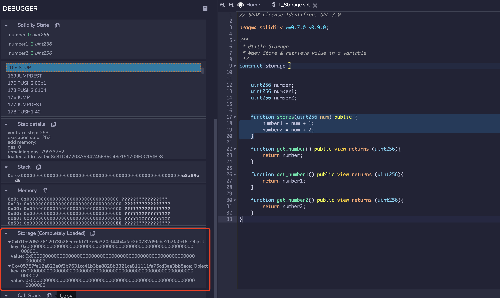

# Account (账户)

## General Background

在当前版本的以太坊采用了Account-based的数据管理架构。在这种架构下，Account (账户)是参与链上交易的基本角色，它承担了链上交易的发起者以及接收者的角色。目前, Account的数据结构的定义在"core/types/state_account.go"文件中(~~在之前的版本中Account的代码位于core/account.go~~)，具体的定义如下所示。

```Golang
// Account is the Ethereum consensus representation of accounts.
// These objects are stored in the main account trie.
type StateAccount struct {
  Nonce    uint64
  Balance  *big.Int
  Root     common.Hash // merkle root of the storage trie
  CodeHash []byte
}
```

具体的来说:

- Nonce 表示该账户发送的交易序号。
- Balance 表示该账户的余额。这里的余额指的是链上的Global Token Ether。
- Root 表示当前账户的下Storage层的 Merkle Patricia Tire的Root。
- CodeHash是该账户的Contract代码的哈希值。

目前，在以太坊中，有两种Account的角色，外部账户(EOA)以及合约(Contract)。EOA由用户之间控制，负责构造签名并发起交易(transaction)。 Contract由用户构造，用于实现一些链上的逻辑。每个账户在某个时刻所有信息(information or data)，称为账户的状态(State)。在以太坊中，transaction是更新账户的信息的基本元。换句话说，在以太坊中transaction可以账户从一个状态转移到另一个状态。这种架构也称为transaction-based state machine。

在实际代码中，这两种角色都是用StateAccount进行定义，并在运行时被封装在stateObject结构中。stateObject的相关代码位于core/state/state_object.go文件。我们注意到这里的stateObject是小写字母开头，说明这个结构主要用于package内部数据操作，并不对外暴露。 以太坊通过account address来管理account state。在某一时刻下的所有的account state构成了world state。以太坊通过Merkle Patricia Tree来管理这些Account state。

```Golang
  // stateObject represents an Ethereum account which is being modified.
  //
  // The usage pattern is as follows:
  // First you need to obtain a state object.
  // Account values can be accessed and modified through the object.
  // Finally, call CommitTrie to write the modified storage trie into a database.
  type stateObject struct {
    address  common.Address
    addrHash common.Hash // hash of ethereum address of the account
    data     Account
    db       *StateDB
    dbErr error

    // Write caches.
    trie Trie // storage trie, which becomes non-nil on first access
    code Code // contract bytecode, which gets set when code is loaded

    // 这里的Storage 是一个 map[common.Hash]common.Hash
    originStorage  Storage // Storage cache of original entries to dedup rewrites, reset for every transaction
    pendingStorage Storage // Storage entries that need to be flushed to disk, at the end of an entire block
    dirtyStorage   Storage // Storage entries that have been modified in the current transaction execution
    fakeStorage    Storage // Fake storage which constructed by caller for debugging purpose.

    // Cache flags.
    // When an object is marked suicided it will be delete from the trie
    // during the "update" phase of the state transition.
    dirtyCode bool // true if the code was updated
    suicided  bool
    deleted   bool
  }
```

## Account & Private Key & Public Kay & Address

- 首先我们通过随机得到一个长度64位account的私钥。这个私钥就是平时需要用户激活钱包时需要的记录，一旦这个私钥暴露了，钱包也将不再安全。
  - 64个16进制位，256bit，32字节
    `var AlicePrivateKey = "289c2857d4598e37fb9647507e47a309d6133539bf21a8b9cb6df88fd5232032"`

- 在得到私钥后，我们使用用私钥来计算公钥和account的地址。基于私钥，我们使用ECDSA算法，选择spec256k1曲线进行计算。通过将私钥带入到所选择的椭圆曲线中，计算出点的坐标即是公钥。以太坊和比特币使用了同样的spec256k1曲线，在实际的代码中，我们也可以看到在crypto中，go-Ethereum直接调用了比特币的代码。
    `ecdsaSK, err := crypto.ToECDSA(privateKey)`

- 对私钥进行椭圆加密之后，我们可以得到64bytes的数，它是由两个32bytes的数构成，这两个数代表了spec256k1曲线上某个点的XY值。
    `ecdsaPK := ecdsaSK.PublicKey`
- 以太坊的地址，是基于上述公钥(ecdsaSK.PublicKey)的 [Keccak-256算法] 之后的后20个字节，并且用0x开头。
  - Keccak-256是SHA-3（Secure Hash Algorithm 3）标准下的一种哈希算法
    `addr := crypto.PubkeyToAddress(ecdsaSK.PublicKey)`

## Signature & Verification

- Hash（m,R）*X +R = S* P
- P是椭圆曲线函数的基点(base point) 可以理解为一个P是一个在曲线C上的一个order 为n的加法循环群的生成元. n为质数。
- R = r * P (r 是个随机数，并不告知verifier)
- 以太坊签名校验的核心思想是:首先基于上面得到的ECDSA下的私钥ecdsaSK对数据msg进行签名(sign)得到msgSig.
    `sig, err := crypto.Sign(msg[:], ecdsaSK)`
    `msgSig := decodeHex(hex.EncodeToString(sig))`

- 然后基于msg和msgSig可以反推出来签名的公钥（用于生成账户地址的公钥ecdsaPK）。
    `recoveredPub, err := crypto.Ecrecover(msg[:],msgSig)`
- 通过反推出来的公钥得到发送者的地址，并与当前txn的发送者在ECDSA下的pk进行对比。
    `crypto.VerifySignature(testPk, msg[:], msgSig[:len(msgSig)-1])`
- 这套体系的安全性保证在于，即使知道了公钥ecdsaPk/ecdsaSK.PublicKey也难以推测出 ecdsaSK以及生成他的privateKey。

## ECDSA & spec256k1曲线

- Elliptic curve point multiplication
  - Point addition P + Q = R
  - Point doubling P + P = 2P
- y^2 = x^3 +7
- Based Point P是在椭圆曲线上的群的生成元
- x次computation on Based Point得到X点，x为私钥，X为公钥。x由Account Private Key得出。
- 在ECC中的+号不是四则运算中的加法，而是定义椭圆曲线C上的新的二元运算(Point Multiplication)。他代表了过两点P和Q的直线与椭圆曲线C的交点R‘关于X轴对称的点R。因为C是关于X轴对称的所以关于X对称的点也都在椭圆曲线上。

## Code Example

- 这部分的示例代码位于: [[example/signature](example/signature)]中。

## Account Storage (账户存储)

在数据表现层面，EOA与Contract不同的点在于，EOA并没有维护自己的Storage层以及代码(codeHash)。相比与外部账户，合约账户额外保存了一个存储层(Storage)用于存储合约代码中持久化的变量和数据结构的数据。

Storage层的基本组成单元称为槽(Slot)。每个Slot的大小是256bits，最多保存32 bytes的数据。作为基本的存储单元，Slot类似于内存的page以及HDD中的Block，可以通过索引的方式被上层函数访问。目前，Slot的索引key的长度同样是32 bytes(256 bits)，寻址空间从0x0000000000000000000000000000000000000000000000000000000000000000 到 0xFFFFFFFFFFFFFFFFFFFFFFFFFFFFFFFFFFFFFFFFFFFFFFFFFFFFFFFFFFFFFFFF。因此，每个Contract的Storage层最多可以保存$2^{256} - 1$个Slot。合约帐户同样使用MPT，作为可验证的索引结构来管理Slot。Storage Tire的根数据被保存在StateAccount结构体中的Root变量中，它是一个32bytes长的byte数组。

### Account Storage Example One

我们使用一个简单的合约来展示Contract Storage层的逻辑，合约代码如下所示。在本例中，Storage合约保存了三个持久化uint256 变量(number, number1, and number2)，并通过stores函数给它们进行赋值。

```solidity
// SPDX-License-Identifier: GPL-3.0

pragma solidity >=0.7.0 <0.9.0;

/**
 * @title Storage
 * @dev Store & retrieve value in a variable
 */
contract Storage {

    uint256 number;
    uint256 number1;
    uint256 number2;

    function stores(uint256 num) public {
        number = num;
        number1 = num + 1;
        number2 = num + 2;
    }
    
    function get_number() public view returns (uint256){
        return number;
    }
    
    function get_number1() public view returns (uint256){
        return number1;
    }
    
    function get_number2() public view returns (uint256){
        return number2;
    }
}
```

我们使用remix来在本地部署这个合约，并使用remix debugger构造transaction调用stores(1)。在Transaction生效之后，合约中三个变量的值将被分别赋给1，2，3。我们观察Storage层会发现，现在的存储层增加了三个Storage Object。每个Object包含一个256 bits的key和256 bits的value字段（本例中表现为64位的16进制数）。其中Key的值是从0开始的递增整数，它代表了Slot的索引值。它们的value则存储了合约中三个变量值(1,2,3)。此外，每个object外层index则是key值的sha3的，"0x290decd9548b62a8d60345a988386fc84ba6bc95484008f6362f93160ef3e563" 对应 0，"0xb10e2d527612073b26eecdfd717e6a320cf44b4afac2b0732d9fcbe2b7fa0cf6" 对应 1。我们在示例代码中展示了这一结果。

```json
{
 "0x290decd9548b62a8d60345a988386fc84ba6bc95484008f6362f93160ef3e563": {
  "key": "0x0000000000000000000000000000000000000000000000000000000000000000",
  "value": "0x0000000000000000000000000000000000000000000000000000000000000001"
 },
 "0xb10e2d527612073b26eecdfd717e6a320cf44b4afac2b0732d9fcbe2b7fa0cf6": {
  "key": "0x0000000000000000000000000000000000000000000000000000000000000001",
  "value": "0x0000000000000000000000000000000000000000000000000000000000000002"
 },
 "0x405787fa12a823e0f2b7631cc41b3ba8828b3321ca811111fa75cd3aa3bb5ace": {
  "key": "0x0000000000000000000000000000000000000000000000000000000000000002",
  "value": "0x0000000000000000000000000000000000000000000000000000000000000003"
 }
}
```

### Account Storage Example Two

值得注意的是，如果我们调整一下合约中变量的声明顺序，从(number，number1，number2)调整为(number 2, number 1, number)，则会在Storage 层观察到不一样的结果。

```solidity
// SPDX-License-Identifier: GPL-3.0

pragma solidity >=0.7.0 <0.9.0;

/**
 * @title Storage
 * @dev Store & retrieve value in a variable
 */
contract Storage {

    uint256 number;
    uint256 number1;
    uint256 number2;

    function stores(uint256 num) public {
        number = num;
        number1 = num + 1;
        number2 = num + 2;
    }
    
    function get_number() public view returns (uint256){
        return number;
    }
    
    function get_number1() public view returns (uint256){
        return number1;
    }
    
    function get_number2() public view returns (uint256){
        return number2;
    }
}
```

我们可以发现number2的结果被存储在了第一个Slot中（Key:"0x0000000000000000000000000000000000000000000000000000000000000000"），而number的值北存储在了第三个Slot中 (Key:"0x0000000000000000000000000000000000000000000000000000000000000002")。

```json
{
  "0x290decd9548b62a8d60345a988386fc84ba6bc95484008f6362f93160ef3e563": {
    "key": "0x0000000000000000000000000000000000000000000000000000000000000000",
    "value": "0x0000000000000000000000000000000000000000000000000000000000000003"
    },
  "0xb10e2d527612073b26eecdfd717e6a320cf44b4afac2b0732d9fcbe2b7fa0cf6": {
    "key": "0x0000000000000000000000000000000000000000000000000000000000000001",
    "value": "0x0000000000000000000000000000000000000000000000000000000000000002"
  },
  "0x405787fa12a823e0f2b7631cc41b3ba8828b3321ca811111fa75cd3aa3bb5ace": {
    "key": "0x0000000000000000000000000000000000000000000000000000000000000002",
    "value": "0x0000000000000000000000000000000000000000000000000000000000000001"
  }
}
```

这个实验可以证明，在Ethereum中，变量对应的存储层的Slot，是按照其在在合约中的声明顺序，从第一个Slot（Key：0）开始分配的。

### Account Storage Example Three

我们再考虑另一种情况：声明的三个变量，但只对其中的两个变量进行赋值。具体的来说，我们按照number，number1，和number2的顺序声明三个uint256变量。但是，在函数stores中只对number1和number2进行赋值操作。合约代码如下所示。

```solidity
// SPDX-License-Identifier: GPL-3.0

pragma solidity >=0.7.0 <0.9.0;

/**
 * @title Storage
 * @dev Store & retrieve value in a variable
 */
contract Storage {
    uint256 number;
    uint256 number1;
    uint256 number2;

    function stores(uint256 num) public {
        number1 = num + 1;
        number2 = num + 2;
    }
    
    function get_number() public view returns (uint256){
        return number;
    }
    
    function get_number1() public view returns (uint256){
        return number1;
    }
    
    function get_number2() public view returns (uint256){
        return number2;
    }
}
```

基于上述合约，我们构造transaction 并调用stores函数，输入参数1，将number1和number2的值修改为2，和3。在transaction执行完成后，我们可以观察到Storage层Slot的结果如下所示。

```json
{
 "0xb10e2d527612073b26eecdfd717e6a320cf44b4afac2b0732d9fcbe2b7fa0cf6": {
  "key": "0x0000000000000000000000000000000000000000000000000000000000000001",
  "value": "0x0000000000000000000000000000000000000000000000000000000000000002"
 },
 "0x405787fa12a823e0f2b7631cc41b3ba8828b3321ca811111fa75cd3aa3bb5ace": {
  "key": "0x0000000000000000000000000000000000000000000000000000000000000002",
  "value": "0x0000000000000000000000000000000000000000000000000000000000000003"
 }
}
```

我们可以看到transaction的执行，只对位置在1和2位置的两个Slot进行了赋值。值得注意的是，在本例中，针对Slot的赋值是从1号Slot的开始，而不是0号Slot。这说明，对于固定长度的变量，保存其值的Slot的位置是在Contract初始化开始的时候就分配的。即使变量只是被声明，且没有真正的赋值，其对应的保存值的Slot已经被分配好了。而不是在第一次给变量赋值的时候，进行分配。



### Account Storage Example Four

在Solidity中，有一类特殊的类型**Address**，用于表示账户的地址信息。例如在ERC-20合约中，所有用户拥有的token信息是被存储在一个(address->uint)的map结构中。这个map的key是Address类型的，它表示了用户实际的address。目前Address的大小为160bits(20bytes)，并不足以填满一整个Slot。因此当Address作为value单独存储在的时候，它并不会排他的独占用一个Slot。我们使用下面的例子来说明。

在下面的示例中，我们声明了三个变量，分别是number(uint256)，addr(address)，以及isTrue(bool)。我们知道，在以太坊中Address是一个长度为20 bytes的字符串，所以一个Address类型是没办法填满整个的Slot的。布尔类型在以太坊中只需要一个bit(0 or 1)就可以表示. 我们构造transaction调用函数storeaddr。函数的input为1 “0xb6186d3a3D32232BB21E87A33a4E176853a49d12”。

```Solidity
// SPDX-License-Identifier: GPL-3.0

pragma solidity >=0.7.0 <0.9.0;

/**
 * @title Storage
 * @dev Store & retrieve value in a variable
 */
contract Storage {


    uint256 number;
    address addr;
    bool isTrue;


    function stores(uint256 num) public {
        // number1 = num + 1;
        // number2 = num + 2;
    }
    
    function storeaddr(uint256 num, address a) public {
        number = num;
        addr = a;
        isTure = true;
    }
    
    function get_number() public view returns (uint256){
        return number;
    }
    
}
```

Transaction的运行后的结果如下面的Json所示。我们可以观察到，在本例中Contract声明了三个变量但是Storage只占用了两个Slot。按照我们上面的发现，在第二个slot(Key:0x0000000000000000000000000000000000000000000000000000000000000001)保存了addr和isTrue的值。

```json
{
 "0x290decd9548b62a8d60345a988386fc84ba6bc95484008f6362f93160ef3e563": {
  "key": "0x0000000000000000000000000000000000000000000000000000000000000000",
  "value": "0x0000000000000000000000000000000000000000000000000000000000000001"
 },
 "0xb10e2d527612073b26eecdfd717e6a320cf44b4afac2b0732d9fcbe2b7fa0cf6": {
  "key": "0x0000000000000000000000000000000000000000000000000000000000000001",
  "value": "0x000000000000000000000001b6186d3a3d32232bb21e87a33a4e176853a49d12"
 }
}
```

### Account Storage Example Five

对于变长数组，map结构的存储构造则更为复杂。虽然Map本身就是key-value的结构，但是在Storage 层并不直接使用map中key的值或者key的值的hash值来作为Storage的索引值。目前，使用map的key的值和当前数组所在变量声明位置对应的slot的值进行拼接，再进行keccak256哈希值作为索引。我们在下面的例子中展示了EVM是如何处理mapping这种变长的数据结构的。在下面的合约中，我们声明了几个定长的uint256类型的对象，和一个string=>uint256类型的Mapping对象。

<!-- Todo: 变长数据结构的存储情况。 -->

```solidity
// SPDX-License-Identifier: GPL-3.0

pragma solidity >=0.7.0 <0.9.0;

/**
 * @title Storage
 * @dev Store & retrieve value in a variable
 */
contract Storage {
    
    uint256 number;
    
    mapping(string => uint256) balances;

    function set_balance(uint256 num) public {
        number = num;
        balances["hsy"] = num;
        balances["lei"] = num + 1;
    }
    
    function get_number() public view returns (uint256){
        return number;
    }
    
}
```

我们发现，对于定长变量number被存储在了第一个Slot(key:0x0000000000000000000000000000000000000000000000000000000000000000)中。但是对于mapping变量balances，它包括的两个数据并没有按照slot的顺序来存储，而且，这两个值对应的key应并不是mapping中key的直接hash。Slot会使用mapping中key的值与当前mapping对应的slot的位置进行拼接之后再进行keccak256的hash来决定map中元素最终的存储位置。

```json
{
 "0x290decd9548b62a8d60345a988386fc84ba6bc95484008f6362f93160ef3e563": {
  "key": "0x0000000000000000000000000000000000000000000000000000000000000000",
  "value": "0x0000000000000000000000000000000000000000000000000000000000000001"
 },
 "0xa601d8e9cd2719ca27765dc16042655548d1ac3600a53ffc06b4a06a12b7c65c": {
  "key": "0xbaded3bf529b04b554de2e4ee0f5702613335896b4041c50a5555b2d5e279f91",
  "value": "0x0000000000000000000000000000000000000000000000000000000000000001"
 },
 "0x53ac6681d92653b13055d2e265b672e2db2b2a19407afb633928597f144edbb0": {
  "key": "0x56a8a0d158d59e2fd9317c46c65b1e902ed92f726ecfe82c06c33c015e8e6682",
  "value": "0x0000000000000000000000000000000000000000000000000000000000000002"
 }
}
```

## Wallet

- KeyStore
- Private Key
- 助记词

## Reference

- <https://www.freecodecamp.org/news/how-to-generate-your-very-own-bitcoin-private-key-7ad0f4936e6c/>
