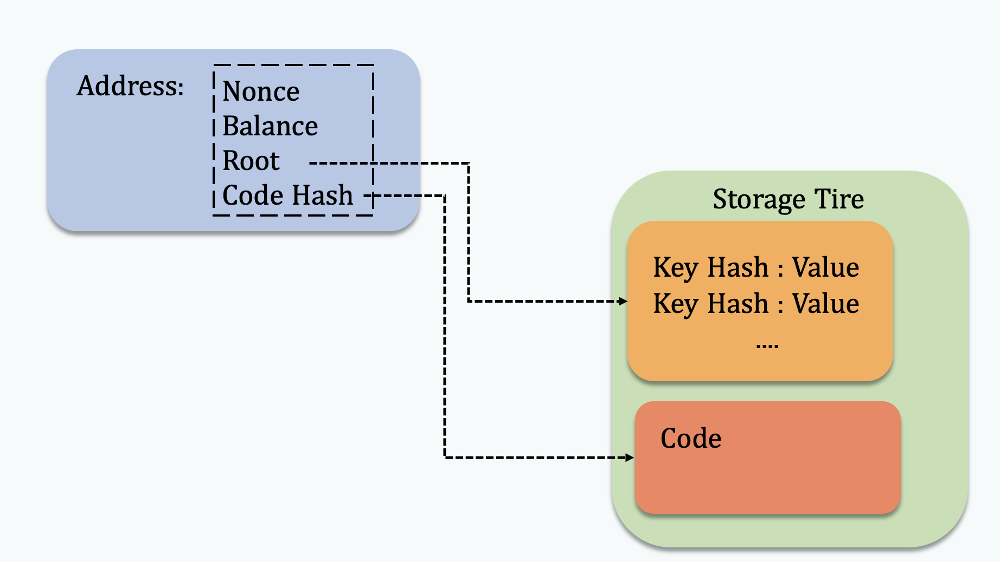

# Account (账户)

## General Background

~~在之前的版本中Account的代码位于core/account.go~~

目前, Account的数据结构的定义在"core/types/state_account.go"文件中，具体如下所示。

```Golang
// Account is the Ethereum consensus representation of accounts.
// These objects are stored in the main account trie.
type StateAccount struct {
  Nonce    uint64
  Balance  *big.Int
  Root     common.Hash // merkle root of the storage trie
  CodeHash []byte
}
```

- Nonce 表示该账户发送的交易序号。
- Balance 表示该账号的余额。
- Root 是当前账号的Storage Tire的 Merkle Root。
- CodeHash是该账号的Contract代码的哈希值。

在以太坊程序运行中，State Account的信息被封装在stateObject结构中, 代码位于core/state/state_object.go文件。

```Golang
  // stateObject represents an Ethereum account which is being modified.
  //
  // The usage pattern is as follows:
  // First you need to obtain a state object.
  // Account values can be accessed and modified through the object.
  // Finally, call CommitTrie to write the modified storage trie into a database.
  type stateObject struct {
    address  common.Address
    addrHash common.Hash // hash of ethereum address of the account
    data     Account
    db       *StateDB
    dbErr error

    // Write caches.
    trie Trie // storage trie, which becomes non-nil on first access
    code Code // contract bytecode, which gets set when code is loaded

    // 这里的Storage 是一个 map[common.Hash]common.Hash
    originStorage  Storage // Storage cache of original entries to dedup rewrites, reset for every transaction
    pendingStorage Storage // Storage entries that need to be flushed to disk, at the end of an entire block
    dirtyStorage   Storage // Storage entries that have been modified in the current transaction execution
    fakeStorage    Storage // Fake storage which constructed by caller for debugging purpose.

    // Cache flags.
    // When an object is marked suicided it will be delete from the trie
    // during the "update" phase of the state transition.
    dirtyCode bool // true if the code was updated
    suicided  bool
    deleted   bool
  }
```

## Account & Private Key & Public Kay & Address

- 首先我们通过随机得到一个长度64位account的私钥。这个私钥就是平时需要用户激活钱包时需要的记录，一旦这个私钥暴露了，钱包也将不再安全。
  - 64个16进制位，256bit，32字节
    `var AlicePrivateKey = "289c2857d4598e37fb9647507e47a309d6133539bf21a8b9cb6df88fd5232032"`

- 在得到私钥后，我们使用用私钥来计算公钥和account的地址。基于私钥，我们使用ECDSA算法，选择spec256k1曲线进行计算。通过将私钥带入到所选择的椭圆曲线中，计算出点的坐标即是公钥。以太坊和比特币使用了同样的spec256k1曲线，在实际的代码中，我们也可以看到在crypto中，go-Ethereum直接调用了比特币的代码。
    `ecdsaSK, err := crypto.ToECDSA(privateKey)`

- 对私钥进行椭圆加密之后，我们可以得到64bytes的数，它是由两个32bytes的数构成，这两个数代表了spec256k1曲线上某个点的XY值。
    `ecdsaPK := ecdsaSK.PublicKey`
- 以太坊的地址，是基于上述公钥(ecdsaSK.PublicKey)的 [Keccak-256算法] 之后的后20个字节，并且用0x开头。
  - Keccak-256是SHA-3（Secure Hash Algorithm 3）标准下的一种哈希算法
    `addr := crypto.PubkeyToAddress(ecdsaSK.PublicKey)`

## Signature & Verification

- Hash（m,R）*X +R = S * P
- P是椭圆曲线函数的基点(base point) 可以理解为一个P是一个在曲线C上的一个order 为n的加法循环群的生成元. n为质数。
- R = r * P (r 是个随机数，并不告知verifier)
- 以太坊签名校验的核心思想是:首先基于上面得到的ECDSA下的私钥ecdsaSK对数据msg进行签名(sign)得到msgSig. 
    `sig, err := crypto.Sign(msg[:], ecdsaSK)`
    `msgSig := decodeHex(hex.EncodeToString(sig))`

- 然后基于msg和msgSig可以反推出来签名的公钥（用于生成账户地址的公钥ecdsaPK）。
    `recoveredPub, err := crypto.Ecrecover(msg[:],msgSig)`
- 通过反推出来的公钥得到发送者的地址，并与当前txn的发送者在ECDSA下的pk进行对比。
    `crypto.VerifySignature(testPk, msg[:], msgSig[:len(msgSig)-1])`
- 这套体系的安全性保证在于，即使知道了公钥ecdsaPk/ecdsaSK.PublicKey也难以推测出 ecdsaSK以及生成他的privateKey。

## ECDSA & spec256k1曲线

- Elliptic curve point multiplication
  - Point addition P + Q = R
  - Point doubling P + P = 2P
- y^2 = x^3 +7
- Based Point P是在椭圆曲线上的群的生成元
- x次computation on Based Point得到X点，x为私钥，X为公钥。x由Account Private Key得出。
- 在ECC中的+号不是四则运算中的加法，而是定义椭圆曲线C上的新的二元运算(Point Multiplication)。他代表了过两点P和Q的直线与椭圆曲线C的交点R‘关于X轴对称的点R。因为C是关于X轴对称的所以关于X对称的点也都在椭圆曲线上。

## Code Example

- 这部分的示例代码位于:[[example/signature](example/signature)]中。

## Account Storage (账户存储)

相比与外部账户，合约额外保存了一个存储层用于存储合约中部的数据。与管理Account的方式相同，在以太坊中每个合约同样使用Tire结构作为可验证的索引结构来管理存储数据。

Storage层的基本组成单元称为槽(Slot)，每个Slot的大小是32 bytes (256 bits)。同时，因为Slot的索引key的长度同样是32 bytes(256 bits)。因此每个Contract最多可以保存$2^{256} - 1$个Slot.

我们使用一个简单的合约来展示Contract Storage层的逻辑，合约代码如下所示。在本例中，Storage合约保存了三个持久化uint256 变量(number, number1, and number2)，并通过stores函数给它们进行赋值。

```solidity
// SPDX-License-Identifier: GPL-3.0

pragma solidity >=0.7.0 <0.9.0;

/**
 * @title Storage
 * @dev Store & retrieve value in a variable
 */
contract Storage {

    uint256 number;
    uint256 number1;
    uint256 number2;

    function stores(uint256 num) public {
        number = num;
        number1 = num + 1;
        number2 = num + 2;
    }
    
    function get_number() public view returns (uint256){
        return number;
    }
    
    function get_number1() public view returns (uint256){
        return number1;
    }
    
    function get_number2() public view returns (uint256){
        return number2;
    }
}
```

我们使用remix来在本地部署这个合约，并使用remix debugger构造transaction调用stores(1)。在Transaction生效之后，合约中三个变量的值将被分别赋给1，2，3。我们观察Storage层会发现，现在的存储层增加了三个Storage Object。每个Object包含一个256 bits的key和256 bits的value字段（本例中表现为64位的16进制数）。其中Key的值是从0开始的递增整数，它代表了Slot的索引值。它们的value则存储了合约中三个变量值(1,2,3)。此外，每个object外层index则是key值的sha3的，"0x290decd9548b62a8d60345a988386fc84ba6bc95484008f6362f93160ef3e563" 对应 0，"0xb10e2d527612073b26eecdfd717e6a320cf44b4afac2b0732d9fcbe2b7fa0cf6" 对应 1。我们在示例代码中展示了这一结果。

```json
{
	"0x290decd9548b62a8d60345a988386fc84ba6bc95484008f6362f93160ef3e563": {
		"key": "0x0000000000000000000000000000000000000000000000000000000000000000",
		"value": "0x0000000000000000000000000000000000000000000000000000000000000001"
	},
	"0xb10e2d527612073b26eecdfd717e6a320cf44b4afac2b0732d9fcbe2b7fa0cf6": {
		"key": "0x0000000000000000000000000000000000000000000000000000000000000001",
		"value": "0x0000000000000000000000000000000000000000000000000000000000000002"
	},
	"0x405787fa12a823e0f2b7631cc41b3ba8828b3321ca811111fa75cd3aa3bb5ace": {
		"key": "0x0000000000000000000000000000000000000000000000000000000000000002",
		"value": "0x0000000000000000000000000000000000000000000000000000000000000003"
	}
}
```

值得注意的是，如果我们调整一下合约中变量的定义顺序，从number，number1，number2 到number 2， number 1， number，则会得到不一样的结果。

```solidity
// SPDX-License-Identifier: GPL-3.0

pragma solidity >=0.7.0 <0.9.0;

/**
 * @title Storage
 * @dev Store & retrieve value in a variable
 */
contract Storage {

    uint256 number;
    uint256 number1;
    uint256 number2;

    function stores(uint256 num) public {
        number = num;
        number1 = num + 1;
        number2 = num + 2;
    }
    
    function get_number() public view returns (uint256){
        return number;
    }
    
    function get_number1() public view returns (uint256){
        return number1;
    }
    
    function get_number2() public view returns (uint256){
        return number2;
    }
}
```

我们可以发现number2的结果被存储在了第一个Slot中（Key:"0x0000000000000000000000000000000000000000000000000000000000000000"），而number的值北存储在了第三个Slot中 (Key:"0x0000000000000000000000000000000000000000000000000000000000000002")。

```json
{
  	"0x290decd9548b62a8d60345a988386fc84ba6bc95484008f6362f93160ef3e563": {
		"key": "0x0000000000000000000000000000000000000000000000000000000000000000",
		"value": "0x0000000000000000000000000000000000000000000000000000000000000003"
	},
	"0xb10e2d527612073b26eecdfd717e6a320cf44b4afac2b0732d9fcbe2b7fa0cf6": {
		"key": "0x0000000000000000000000000000000000000000000000000000000000000001",
		"value": "0x0000000000000000000000000000000000000000000000000000000000000002"
	},	"0x405787fa12a823e0f2b7631cc41b3ba8828b3321ca811111fa75cd3aa3bb5ace": {
		"key": "0x0000000000000000000000000000000000000000000000000000000000000002",
		"value": "0x0000000000000000000000000000000000000000000000000000000000000001"
	}

}
```

这个实验可以证明，在Ethereum中，定长变量(例如 unit256)按照其在在合约中的定义顺序，从第一个Slot（Key：0）开始存储。变长数组，map结构的存储构造则更为复杂，具体可以参考solidity官方文档。

<!-- Todo: 变长数据结构的存储情况。 -->

<!-- Storage 是一个map, key 是一个hash值，value 也是一个hash。这里的hash是Ethereum中的common.Hash，他表示了一个32(HashLength) 节的byte数组 [HashLength]byte, 通常用于Keccak256的hash值和其他长度为32字节的值。 -->

<!--  -->

## Wallet

- KeyStore
- Private Key
- 助记词


## Reference

- https://www.freecodecamp.org/news/how-to-generate-your-very-own-bitcoin-private-key-7ad0f4936e6c/