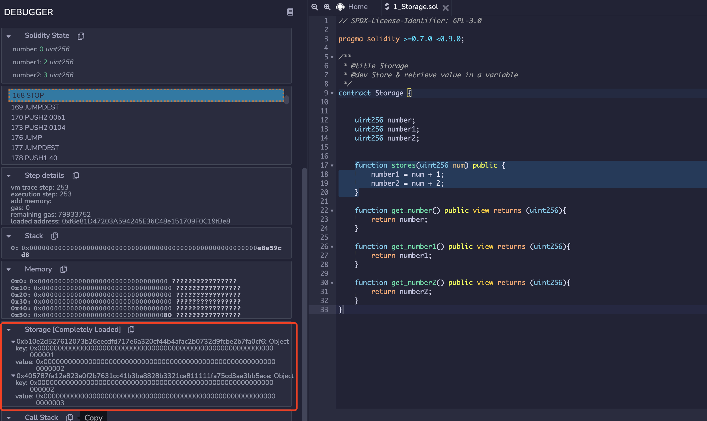

# Account and Contract

## 概述

我们常常听到这样一个说法，"Ethereum 和 Bitcoin 最大的不同之一是二者使用管理链上数据的模型不同。其中，而 Bitcoin 是基于 UTXO 模型的 Blockchain/Ledger 系统，Ethereum 是基于 Account 模型的系统"。那么，这个另辟蹊径的 Account 模型究竟不同在何处呢？在本文中我们来探索一下以太坊中的基本数据单元 (Metadata) 之一的 Account。

简单的来说，Ethereum 依赖于一种*基于交易的状态机模型* (Transaction-based State Machine)。其中，状态 (State) 表示了某一实例 (instance) 在*某一时刻*下的值 (value)。在以太坊中，State 对应的基本数据结构，称为 StateObject。当 StateObject 的值发生了变化时，我们称为*状态转移*。在 Ethereum 的运行模型中，StateObject 所包含的数据会因为 Transaction 的执行引发数据更新/删除/创建，引发状态转移，我们说：StateObject 的状态从当前的 State 转移到另一个 State。

在 Ethereum 中，承载 StateObject 的具体实例就是 Ethereum 中的 Account。通常，我们提到的 State 具体指的就是 Account 在某个时刻的包含的数据的值。

- Account --> StateObject
- State   --> The value/data of the Account

总的来说，Account （账户）是参与链上交易 (Transaction) 的基本角色，是 Ethereum 状态机模型中的基本单位，承担了链上交易的发起者以及接收者的角色。目前，在以太坊中，有两种类型的 Account，分别是外部账户 (EOA) 以及合约账户 (Contract)。

### EOA

外部账户 (EOA) 是由用户直接控制的账户，负责签名并发起交易 (Transaction)。用户通过 Account 的私钥来保证对账户数据的控制权。

合约账户 (Contract)，简称为合约，是由外部账户通过 Transaction 创建。合约账户，保存了**不可篡改的图灵完备的代码段**，以及保存一些**持久化的数据**。这些代码段使用专用语言书写 (Like: Solidity)，并通常提供一些对外部访问 API 接口函数。这些 API 接口可以通过 Transaction，或者通过本地/第三方提供的 RPC 服务来调用。这种模式构成了目前的 DApp 生态圈的基础。

通常，合约中的函数用于计算以及查询或修改合约中的持久化数据。我们经常看到这样的描述"**一旦被记录到区块链上数据不可被修改**，或者**不可篡改的智能合约**"。现在我们知道这种描述是不准确。针对一个链上的智能合约，不可修改/篡改的部分是合约中的代码段，或说是合约中的*函数逻辑*/*代码逻辑是*不可以被修改/篡改的。而链上合约中的持久化的数据是可以通过调用代码段中的函数进行数据操作的 (CURD)，包括修改和删除，具体取决于合约函数中的代码逻辑。

根据*合约中函数是否会修改合约中持久化的变量*，合约中的函数可以分为两种，只读函数和写函数。
如果用户**只**希望查询某些合约中的持久化数据，而不对数据进行修改的话，那么用户只需要调用相关的只读函数。调用只读函数不需要通过构造一个 Transaction 来查询数据。用户可以通过直接调用本地数据或者第三方提供的数据，来调用对应的函数。如果用户需要对合约中的数据进行更新，那么他就要构造一个 Transaction 来请求合约中相对应的写函数。注意，当用户通过构造 Transaction 的方式来调用合约中的函数时，每个 Transaction 只能调用一个合约中的一个 API 函数。

对于如何编写合约，以及 Ethereum 如何解析 Transaction 并调用对应的合约中 API 的，我们会在后面的文章中详细的进行解析。

## StateObject, Account, Contract

在实际代码中，这两种 Account 都是由`stateObject`这一数据结构定义的。`stateObject`的相关代码位于* core/state/state_object.go *文件中，隶属于* package state*。我们摘录了`stateObject`的结构代码，如下所示。通过下面的代码，我们可以观察到，`stateObject`是由小写字母开头。根据 go 语言的特性，我们可以知道这个结构主要用于 package 内部数据操作，并不对外暴露。

```go
  type stateObject struct {
    address  common.Address
    addrHash common.Hash // hash of ethereum address of the account
    data     types.StateAccount
    db       *StateDB
    dbErr error

    // Write caches.
    trie Trie // storage trie, which becomes non-nil on first access
    code Code // contract bytecode, which gets set when code is loaded

    // 这里的 Storage 是一个 map[common.Hash]common.Hash
    originStorage  Storage // Storage cache of original entries to dedup rewrites, reset for every transaction
    pendingStorage Storage // Storage entries that need to be flushed to disk, at the end of an entire block
    dirtyStorage   Storage // Storage entries that have been modified in the current transaction execution
    fakeStorage    Storage // Fake storage which constructed by caller for debugging purpose.

    // Cache flags.
    // When an object is marked suicided it will be delete from the trie
    // during the "update" phase of the state transition.
    dirtyCode bool // true if the code was updated
    suicided  bool
    deleted   bool
  }
```

### Address

在`stateObject`这一结构体中，开头的两个成员变量为`address`以及 address 的哈希值`addrHash`。`address`是 common.Address 类型，`addrHash`是 common.Hash 类型，它们分别对应了一个 20 字节长度的 byte 数组和一个 32 字节长度的 byte 数组。关于这两种数据类型的定义如下所示。

```go
// Lengths of hashes and addresses in bytes.
const (
 // HashLength is the expected length of the hash
 HashLength = 32
 // AddressLength is the expected length of the address
 AddressLength = 20
)
// Address represents the 20 byte address of an Ethereum account.
type Address [AddressLength]byte
// Hash represents the 32 byte Keccak256 hash of arbitrary data.
type Hash [HashLength]byte
```

在 Ethereum 中，每个 Account 都拥有独一无二的地址。Address 作为每个 Account 的身份信息，类似于现实生活中的身份证，它与用户信息时刻绑定而且不能被修改。

### data and StateAccount

继续向下探索，我们会遇到成员变量 data，它是一个`types.StateAccount`类型的变量。在上面的分析中我们提到，`stateObject`这种类型只对 Package State 这个内部使用。所以相应的，Package State 也为外部 Package API 提供了与 Account 相关的数据类型"State Account"。在上面的代码中我们就可以看到，"State Account"对应了 State Object 中"data Account"成员变量。State Account 的具体数据结构的被定义在"core/types/state_account.go"文件中，其定义如下所示。

```go
// Account is the Ethereum consensus representation of accounts.
// These objects are stored in the main account trie.
type StateAccount struct {
  Nonce    uint64
  Balance  *big.Int
  Root     common.Hash // merkle root of the storage trie
  CodeHash []byte
}
```

其中的包含四个变量为：

- Nonce 表示该账户发送的交易序号，随着账户发送的交易数量的增加而单调增加。每次发送一个交易，Nonce 的值就会加 1。
- Balance 表示该账户的余额。这里的余额指的是链上的 Global/Native Token Ether。
- Root 表示当前账户的下 Storage 层的 Merkle Patricia Trie 的 Root。EOA 账户这个部分为空值。
- CodeHash 是该账户的 Contract 代码的哈希值。EOA 账户这个部分为空值。

### db

上述的几个成员变量基本覆盖了 Account 主工作流相关的全部成员变量。那么我们继续向下看，会遇到`db`和`dbErr`这两个成员变量。db 这个变量保存了一个 StateDB 类型的指针。这是为了方便调用 StateDB 相关的 API 对 Account 所对应的 stateObject 进行操作。StateDB 本质上是 Ethereum 用于管理 stateObject 信息的而抽象出来的内存数据库。所有的 Account 数据的更新，检索都会使用 StateDB 提供的 API。关于 StateDB 的具体实现，功能，以及如何与更底层 (leveldb) 进行结合的，我们会在之后的文章中进行详细描述。

### Cache

对于剩下的成员变量，它们的主要用于内存 Cache。trie 用于保存 Contract 中的持久化存储的数据，code 用于缓存 contract 中的代码段到内存中，它是一个 byte 数组。剩下的四个 Storage 字段主要在执行 Transaction 的时候缓存 Contract 合约修改的持久化数据，比如 dirtyStorage 就用于缓存在 Block 被 Finalize 之前，Transaction 所修改的合约中的持久化存储数据。对于外部账户，由于没有代码字段，所以对应 stateObject 对象中的 code 字段，以及四个 Storage 类型的字段对应的变量的值都为空 (originStorage, pendingStorage, dirtyStorage, fakeStorage)。

从调用关系上看，这四个缓存变量的调用关系是 originStorage --> dirtyStorage--> pendingStorage。关于 Contract 的 Storage 层的详细信息，我们会在后面部分进行详细的描述。

## 深入 Account

### Private Key & Public Kay & Address

#### 账户安全的问题

我们经常会在各种科技网站，自媒体上听到这样的说法，"用户在区块链系统中保存的 Cryptocurrency/Token，除了用户自己，不存在一个中心化的第三方可以不经过用户的允许转走你的财富"。这个说法基本是正确的。目前，用户账户里的由链级别定义 Crypto，或者称为原生货币 (Native Token)，比如 Ether，Bitcoin，BNB(Only in BSC)，是没办法被第三方在不被批准的情况下转走的。这是因为链级别上的所有数据的修改都要经过用户私钥 (Private Key) 签名的 Transaction。只要用户保管好自己账户的私钥 (Private Key)，保证其没有被第三方知晓，就没有人可以转走你链上的财富。

我们说上述说法是基本正确，而不是完全正确的原因有两个。首先，用户的链上数据安全是基于当前 Ethereum 使用的密码学工具足够保证：不存在第三方可以在**有限的时间**内在**不知道用户私钥的前提**下获取到用户的私钥信息来伪造签名交易。当然这个安全保证前提是当今 Ethereum 使用的密码学工具的强度足够大，没有计算机可以在有限的时间内 hack 出用户的私钥信息。在量子计算机出现之前，目前 Ethereum 和其他 Blockchain 使用的密码学工具的强度都是足够安全的。这也是为什么很多新的区块链项目在研究抗量子计算机密码体系的原因。第二点原因是，当今很多的所谓的 Crypto/Token 并不是链级别的数据，而是在链上合约中存储的数据，比如 ERC-20 Token 和 NFT 对应的 ERC-721 的 Token。由于这部分的 Token 都是基于合约代码生成和维护的，所以这部分 Token 的安全依赖于合约本身的安全。如果合约本身的代码是有问题的，存在后门或者漏洞，比如存在给第三方任意提取其他账户下 Token 的漏洞，那么即使用户的私钥信息没有泄漏，合约中的 Token 仍然可以被第三方获取到。由于合约的代码段在链上是不可修改的，合约代码的安全性是极其重要的。所以，有很多研究人员，技术团队在进行合约审计方面的工作，来保证上传的合约代码是安全的。此外随着 Layer-2 技术和一些跨链技术的发展，用户持有的“Token”，在很多情况下不是我们上面提到的安全的 Naive Token，而是 ERC-20 甚至只是其他合约中的简单数值记录。这种类型的资产的安全性是低于 layer-1 上的 Native Token 的。用户在持有这类资产的时候需要小心。这里我们推荐阅读 Jay Freeman 所分析的关于一个热门 Layer-2 系统 Optimism 上的由于非 Naive Token 造成的 [任意提取漏洞](https://www.saurik.com/optimism.html)。

#### Account Generation

下面我们简单讲述，在 Ethereum 中一个账户的私钥和地址是如何产生的。

- 首先我们通过随机得到一个长度 64 位 account 的私钥。这个私钥就是平时需要用户激活钱包时需要的记录，一旦这个私钥暴露了，钱包也将不再安全。
  - 64 个 16 进制位，256bit，32 字节
    `var AlicePrivateKey = "289c2857d4598e37fb9647507e47a309d6133539bf21a8b9cb6df88fd5232032"`

- 在得到私钥后，我们使用私钥来计算公钥和 account 的地址。基于上述私钥，我们使用 ECDSA 算法，选择 spec256k1 曲线进行计算。通过将私钥带入到所选择的椭圆曲线中，计算出点的坐标即是公钥。以太坊和比特币使用了同样的 spec256k1 曲线，在实际的代码中，我们也可以看到在 crypto 中，go-Ethereum 直接调用了比特币的代码。
    `ecdsaSK, err := crypto.ToECDSA(privateKey)`

- 对私钥进行椭圆加密之后，我们可以得到 64bytes 的数，它是由两个 32bytes 的数构成，这两个数代表了 spec256k1 曲线上某个点的 XY 值。
    `ecdsaPK := ecdsaSK.PublicKey`
- 以太坊的地址，是基于上述公钥 (ecdsaSK.PublicKey) 的 [Keccak-256 算法] 之后的后 20 个字节，并且用 0x 开头。
  - Keccak-256 是 SHA-3（Secure Hash Algorithm 3）标准下的一种哈希算法
    `addr := crypto.PubkeyToAddress(ecdsaSK.PublicKey)`

#### Signature & Verification

- Hash（m,R）*X +R = S* P
- P 是椭圆曲线函数的基点 (base point) 可以理解为一个 P 是一个在曲线 C 上的一个 order 为 n 的加法循环群的生成元。n 为质数。
- R = r * P (r 是个随机数，并不告知 verifier)
- 以太坊签名校验的核心思想是：首先基于上面得到的 ECDSA 下的私钥 ecdsaSK 对数据 msg 进行签名 (sign) 得到 msgSig.
    `sig, err := crypto.Sign(msg[:], ecdsaSK)`
    `msgSig := decodeHex(hex.EncodeToString(sig))`

- 然后基于 msg 和 msgSig 可以反推出来签名的公钥（用于生成账户地址的公钥 ecdsaPK）。
    `recoveredPub, err := crypto.Ecrecover(msg[:],msgSig)`
- 通过反推出来的公钥得到发送者的地址，并与当前 txn 的发送者在 ECDSA 下的 pk 进行对比。
    `crypto.VerifySignature(testPk, msg[:], msgSig[:len(msgSig)-1])`
- 这套体系的安全性保证在于，即使知道了公钥 ecdsaPk/ecdsaSK.PublicKey 也难以推测出 ecdsaSK 以及生成他的 privateKey。

#### ECDSA & spec256k1 曲线

- Elliptic curve point multiplication
  - Point addition P + Q = R
  - Point doubling P + P = 2P
- y^2 = x^3 +7
- Based Point P 是在椭圆曲线上的群的生成元
- x 次 computation on Based Point 得到 X 点，x 为私钥，X 为公钥。x 由 Account Private Key 得出。
- 在 ECC 中的+号不是四则运算中的加法，而是定义椭圆曲线 C 上的新的二元运算 (Point Multiplication)。他代表了过两点 P 和 Q 的直线与椭圆曲线 C 的交点 R‘关于 X 轴对称的点 R。因为 C 是关于 X 轴对称的所以关于 X 对称的点也都在椭圆曲线上。

## 深入 Contract

- 这部分的示例代码位于：[[example/signature](example/signature)] 中。

### Contract Storage （合约存储）

[在文章的开头](#general Background) 我们提到，在外部账户对应的 stateObject 结构体的实例中，有四个 Storage 类型的变量是空值。那显然的，这四个变量是为 Contract 类型的账户准备的。

在* state_object.go *文件的开头部分 (41 行左右），我们可以找到 Storage 类型的定义。具体如下所示。

```go
type Storage map[common.Hash]common.Hash
```

我们可以看到，*Storage *是一个 key 和 value 都是`common.Hash`类型的 map 结构。common.Hash 类型，则对应了一个长度为 32bytes 的 byte 类型数组。这个类型在 go-ethereum 中被大量使用，通常用于表示 32 字节长度的数据，比如 Keccak256 函数的哈希值。在之后的旅程中，我们也会经常看到它的身影，它的定义在 common.type.go 文件中。

```go
// HashLength is the expected length of the hash
HashLength = 32
// Hash represents the 32 byte Keccak256 hash of arbitrary data.
type Hash [HashLength]byte
```

从功能层面讲，外部账户 (EOA) 与合约账户 (Contract) 不同的点在于，外部账户并没有维护自己的代码 (codeHash) 以及额外的 Storage 层。相比与外部账户，合约账户额外保存了一个存储层 (Storage) 用于存储合约代码中持久化的变量的数据。在上文中我们提到，StateObject 中的声明的四个 Storage 类型的变量，就是作为 Contract Storage 层的内存缓存。

在 Ethereum 中，每个合约都维护了自己的*独立*的 Storage 空间，我们称为 Storage 层。Storage 层的基本组成单元称为槽 (Slot)，若干个 Slot 按照* Stack *的方式集合在一起构造成了 Storage 层。每个 Slot 的大小是 256 bits，也就是最多保存 32 bytes 的数据。作为基本的存储单元，Slot 管理的方式与内存或者 HDD 中的基本单元的管理方式类似，通过地址索引的方式被上层函数访问。Slot 的地址索引的长度同样是 32 bytes(256 bits)，寻址空间从 0x0000000000000000000000000000000000000000000000000000000000000000 到 0xFFFFFFFFFFFFFFFFFFFFFFFFFFFFFFFFFFFFFFFFFFFFFFFFFFFFFFFFFFFFFFFF。因此，每个 Contract 的 Storage 层最多可以保存$2^{256} - 1$个 Slot。也就说在理论状态下，一个 Contract 可以最多保存$(2^{256} - 1)$ bytes 的数据，这是个相当大的数字。Contract 同样使用 MPT 来管理 Storage 层的 Slot。值得注意的是，Storage 层的数据并不会被打包进入 Block 中。唯一与 Chain 内数据相关的是，Storage Trie 的根数据被保存在 StateAccount 结构体中的 Root 变量中（它是一个 32bytes 长的 byte 数组）。当某个 Contract 的 Storage 层的数据发生变化时，根据骨牌效应，向上传导到 World State Root 的值发生变化，从而影响到 Chain 数据。目前，Storage 层的数据读取和修改是在执行相关 Transaction 的时候，通过 EVM 调用两个专用的指令* OpSload *和* OpSstore *触发。

我们知道目前 Ethereum 中的大部分合约都通过 Solidity 语言编写。Solidity 做为强类型的图灵完备的语言，支持多种类型的变量。总的来说，根据变量的长度性质，Ethereum 中的持久化的变量可以分为定长的变量和不定长度的变量两种。定长的变量有常见的单变量类型，比如 uint256。不定长的变量包括了由若干单变量组成的 Array，以及 KV 形式的 Map 类型。

根据上面的介绍，我们了解到对 Contract Storage 层的访问是通过 Slot 的地址来进行的。请读者先思考下面的几个问题：

- **如何给定一个包含若干持久化存储变量的 Solidity 的合约，EVM 是怎么给其包含的变量分配存储空间的呢？**
- 怎么保证 Contract Storage 的一致性读写的？（怎么保证每个合约的验证者和执行者都能获取到相同的数据？)

我们将通过下面的一些实例来展示，在 Ethereum 中，Contract 是如何保存持久化变量的，以及保证所有的参与者都能一致性读写的 Contract 中的数据的。

### Contract Storage Example One

我们使用一个简单的合约来展示 Contract Storage 层的逻辑，合约代码如下所示。在本例中，我们使用了一个叫做"Storage"合约，其中定义了了三个持久化 uint256 类型的变量分别是 number, number1, 以及 number2。同时，我们定义一个 stores 函数给这个三个变量进行赋值。

```solidity
// SPDX-License-Identifier: GPL-3.0

pragma solidity >=0.7.0 <0.9.0;

/**
 * @title Storage
 * @dev Store & retrieve value in a variable
 */
contract Storage {

    uint256 number;
    uint256 number1;
    uint256 number2;

    function stores(uint256 num) public {
        number = num;
        number1 = num + 1;
        number2 = num + 2;
    }
    
    function get_number() public view returns (uint256){
        return number;
    }
    
    function get_number1() public view returns (uint256){
        return number1;
    }
    
    function get_number2() public view returns (uint256){
        return number2;
    }
}
```

我们使用 [Remix](https://remix.ethereum.org/) 来在本地部署这个合约，并构造一个调用 stores(1) 函数的 Transaction，同时使用 Remix debugger 来 Storage 层的变化。在 Transaction 生效之后，合约中三个变量的值将被分别赋给 1，2，3。此时，我们观察 Storage 层会发现，存储层增加了三个 Storage Object。这三个 Storage Object 对应了三个 Slot。所以在本例中，合约增加了三个 Slots 来存储数据。我们可以发现每个 Storage Object 由三个字段组成，分别是一个 32 bytes 的 key 字段和 32 bytess 的 value 字段，以及外层的一个 32 bytes 的字段。这三个字段在下面的例子中都表现为 64 位的 16 进制数 (32 Bytes)。

下面我们来逐个解释一下这个三个值的实际意义。首先我们观察内部的 Key-Value 对，可以发现下面三个 Storage Object 中 key 的值其实是从 0 开始的递增整数，分别是 0，1，2。它代表了当前 Slot 的地址索引值，或者说该 Slot 在 Storage 层对应的绝对位置 (Position)。比如，key 的值为 0 时，它代表整个 Storage 层中的第 1 个 Slot，或者说在 1 号位置的 Slot，当 key 等于 1 时代表 Storage 层中的第 2 个 Slot，以此类推。每个 Storage Object 中的 value 变量，存储了合约中三个变量的值 (1,2,3)。而 Storage Object 外层的值由等于 Storage Object 的 key 的值的 sha3 的哈希值。比如，下面例子中的第一个 Storage Object 的外层索引值"0x290decd9548b62a8d60345a988386fc84ba6bc95484008f6362f93160ef3e563" 是通过 keccak256(0) 计算出的值，代表了第一个 Slot position 的 Sha3 的哈希，而"0xb10e2d527612073b26eecdfd717e6a320cf44b4afac2b0732d9fcbe2b7fa0cf6" 对应了是 keccak(1) 的值。我们在 [示例代码](../example/account/main.go) 中展示了如何计算的过程。

```json
{
 "0x290decd9548b62a8d60345a988386fc84ba6bc95484008f6362f93160ef3e563": {
  "key": "0x0000000000000000000000000000000000000000000000000000000000000000",
  "value": "0x0000000000000000000000000000000000000000000000000000000000000001"
 },
 "0xb10e2d527612073b26eecdfd717e6a320cf44b4afac2b0732d9fcbe2b7fa0cf6": {
  "key": "0x0000000000000000000000000000000000000000000000000000000000000001",
  "value": "0x0000000000000000000000000000000000000000000000000000000000000002"
 },
 "0x405787fa12a823e0f2b7631cc41b3ba8828b3321ca811111fa75cd3aa3bb5ace": {
  "key": "0x0000000000000000000000000000000000000000000000000000000000000002",
  "value": "0x0000000000000000000000000000000000000000000000000000000000000003"
 }
}
```

读者可能以及发现了，在这个 Storage Object 中，外层的索引值其实与 Key 值的关系是一一对应的，或者说这两个键值本质上都是关于 Slot 位置的唯一索引。这里我们简单讲述一下这两个值在使用上的区别。Key 值代表了 Slot 在 Storage 层的 Position，这个值用于会作为 stateObject.go/getState() 以及 setState() 函数的参数，用于定位 Slot。如果我们继续深入上面的两个函数，我们就会发现，当内存中不存在该 Slot 的缓存时，geth 就会尝试从更底层的数据库中来获取这个 Slot 的值。而 Storage 在更底层的数据，是由 Secure Trie 来维护的，Secure Trie 中的 Key 值都是需要 Hash 的。所以在 Secure Trie 层我们查询/修改需要的键值就是外层的 hash 值。具体的关于 Secure Trie 的描述可以参考 [Trie](10_tire_statedb.md) 这一章节。总结下来，在上层函数 (stateObject) 调用中使用的键值是 Slot 的 Position，在下层的函数 (Trie) 调用中使用的键值是 Slot 的 Position 的哈希值。

```go
func (t *SecureTrie) TryGet(key []byte) ([]byte, error) {
  // Secure Trie 中查询的例子
  // 这里的 key 还是 Slot 的 Position
  // 但是在更下层的 Call 更下层的函数的时候使用了这个 Key 的 hash 值作为查询使用的键值。
  return t.trie.TryGet(t.hashKey(key))
}
```

### Account Storage Example Two

下面我们来看另外的一个例子。在这个例子中，我们调整一下合约中变量的声明顺序，从 (number，number1，number2) 调整为 (number 2, number 1, number)。合约代码如下所示。

```solidity
// SPDX-License-Identifier: GPL-3.0

pragma solidity >=0.7.0 <0.9.0;

/**
 * @title Storage
 * @dev Store & retrieve value in a variable
 */
contract Storage {

    uint256 number2;
    uint256 number;

    function stores(uint256 num) public {
        number = num;
        number1 = num + 1;
        number2 = num + 2;
    }
    
    function get_number() public view returns (uint256){
        return number;
    }
    
    function get_number1() public view returns (uint256){
        return number1;
    }
    
    function get_number2() public view returns (uint256){
        return number2;
    }
}
```

同样我们还是构造 Transaction 来调用合约中的 stores 函数。此时我们可以在 Storage 层观察到不一样的结果。我们发现 number2 这个变量的值被存储在了第一个 Slot 中（Key:"0x0000000000000000000000000000000000000000000000000000000000000000"），而 number 这个变量的值北存储在了第三个 Slot 中 (Key:"0x0000000000000000000000000000000000000000000000000000000000000002")。

```json
{
  "0x290decd9548b62a8d60345a988386fc84ba6bc95484008f6362f93160ef3e563": {
    "key": "0x0000000000000000000000000000000000000000000000000000000000000000",
    "value": "0x0000000000000000000000000000000000000000000000000000000000000003"
    },
  "0xb10e2d527612073b26eecdfd717e6a320cf44b4afac2b0732d9fcbe2b7fa0cf6": {
    "key": "0x0000000000000000000000000000000000000000000000000000000000000001",
    "value": "0x0000000000000000000000000000000000000000000000000000000000000002"
  },
  "0x405787fa12a823e0f2b7631cc41b3ba8828b3321ca811111fa75cd3aa3bb5ace": {
    "key": "0x0000000000000000000000000000000000000000000000000000000000000002",
    "value": "0x0000000000000000000000000000000000000000000000000000000000000001"
  }
}
```

这个例子可以说明，在 Ethereum 中，变量对应的存储层的 Slot，是按照其在在合约中的声明顺序，从第一个 Slot（position：0）开始分配的。

### Account Storage Example Three

我们再考虑另一种情况：声明的三个变量，但只对其中的两个变量进行赋值。具体的来说，我们按照 number，number1，和 number2 的顺序声明三个 uint256 变量。但是，在函数 stores 中只对 number1 和 number2 进行赋值操作。合约代码如下所示。

```solidity
// SPDX-License-Identifier: GPL-3.0

pragma solidity >=0.7.0 <0.9.0;

/**
 * @title Storage
 * @dev Store & retrieve value in a variable
 */
contract Storage {
    uint256 number;
    uint256 number1;
    uint256 number2;

    function stores(uint256 num) public {
        number1 = num + 1;
        number2 = num + 2;
    }
    
    function get_number() public view returns (uint256){
        return number;
    }
    
    function get_number1() public view returns (uint256){
        return number1;
    }
    
    function get_number2() public view returns (uint256){
        return number2;
    }
}
```

基于上述合约，我们构造 transaction 并调用 stores 函数，输入参数 1，将 number1 和 number2 的值修改为 2，和 3。在 transaction 执行完成后，我们可以观察到 Storage 层 Slot 的结果如下所示。

```json
{
 "0xb10e2d527612073b26eecdfd717e6a320cf44b4afac2b0732d9fcbe2b7fa0cf6": {
  "key": "0x0000000000000000000000000000000000000000000000000000000000000001",
  "value": "0x0000000000000000000000000000000000000000000000000000000000000002"
 },
 "0x405787fa12a823e0f2b7631cc41b3ba8828b3321ca811111fa75cd3aa3bb5ace": {
  "key": "0x0000000000000000000000000000000000000000000000000000000000000002",
  "value": "0x0000000000000000000000000000000000000000000000000000000000000003"
 }
}
```

我们可以观察到，stores 函数调用的结果只对在合约的 Storage 层中位置在 1 和 2 位置的两个 Slot 进行了赋值。值得注意的是，在本例中，对于 Slot 的赋值是从 1 号位置 Slot 的开始，而不是 0 号 Slot。这说明对于固定长度的变量，其值的所占用的 Slot 的位置在 Contract 初始化开始的时候就已经分配的。即使变量只是被声明还没有真正的赋值，保存其值所需要的 Slot 也已经被 EVM 分配完毕。而不是在第一次进行变量赋值的时候，进行再对变量所需要的的 Slot 进行分配。



### Account Storage Example Four

在 Solidity 中，有一类特殊的变量类型** Address**，通常用于表示账户的地址信息。例如在 ERC-20 合约中，用户拥有的 token 信息是被存储在一个 (address->uint) 的 map 结构中。在这个 map 中，key 就是 Address 类型的，它表示了用户实际的 address。目前 Address 的大小为 160bits(20bytes)，并不足以填满一整个 Slot。因此当 Address 作为 value 单独存储在的时候，它并不会排他的独占用一个 Slot。我们使用下面的例子来说明。

在下面的示例中，我们声明了三个变量，分别是 number(uint256)，addr(address)，以及 isTrue(bool)。我们知道，在以太坊中 Address 类型变量的长度是 20 bytes，所以一个 Address 类型的变量是没办法填满整个的 Slot(32 bytes) 的。同时，布尔类型在以太坊中只需要一个 bit(0 or 1) 的空间。因此，我们构造 transaction 并调用函数 storeaddr 来给这三个变量赋值，函数的 input 参数是一个 uint256 的值，一个 address 类型的值，分别为{1, “0xb6186d3a3D32232BB21E87A33a4E176853a49d12”}。

```solidity
// SPDX-License-Identifier: GPL-3.0

pragma solidity >=0.7.0 <0.9.0;

/**
 * @title Storage
 * @dev Store & retrieve value in a variable
 */
contract Storage {

    uint256 number;
    address addr;
    bool isTrue;

    function stores(uint256 num) public {
        // number1 = num + 1;
        // number2 = num + 2;
    }
    
    function storeaddr(uint256 num, address a) public {
        number = num;
        addr = a;
        isTure = true;
    }
    
    function get_number() public view returns (uint256){
        return number;
    }
    
}
```

Transaction 的运行后 Storage 层的结果如下面的 Json 所示。我们可以观察到，在本例中 Contract 声明了三个变量，但是在 Storage 层只调用了两个 Slot。第一个 Slot 用于保存了 uint256 的值，而在第二个 Slot 中 (Key:0x0000000000000000000000000000000000000000000000000000000000000001) 保存了 addr 和 isTrue 的值。这里需要注意，虽然这种将两个小于 32 bytes 长的变量合并到一个 Slot 的做法节省了物理空间，但是也同样带来读写放大的问题。因为在 Geth 中，读操作最小的读的单位都是按照 32bytes 来进行的。在本例中，即使我们只需要读取 isTrue 或者 addr 这两个变量的值，在具体的函数调用中，我们仍然需要将对应的 Slot 先读取到内存中。同样的，如果我们想修改这两个变量的值，同样需要对整个的 Slot 进行重写。这无疑增加了额外的开销。所以在 Ethereum 使用 32 bytes 的变量，在某些情况下消耗的 Gas 反而比更小长度类型的变量要小（例如 unit8)。这也是为什么 Ethereum 官方也建议使用长度为 32 bytes 变量的原因。

// Todo Gas cost? here or in EVM Section

```json
{
 "0x290decd9548b62a8d60345a988386fc84ba6bc95484008f6362f93160ef3e563": {
  "key": "0x0000000000000000000000000000000000000000000000000000000000000000",
  "value": "0x0000000000000000000000000000000000000000000000000000000000000001"
 },
 "0xb10e2d527612073b26eecdfd717e6a320cf44b4afac2b0732d9fcbe2b7fa0cf6": {
  "key": "0x0000000000000000000000000000000000000000000000000000000000000001",
  "value": "0x000000000000000000000001b6186d3a3d32232bb21e87a33a4e176853a49d12"
 }
}
```

### Account Storage Example Five

对于变长数组和 Map 结构的变量存储分配则相对的复杂。虽然 Map 本身就是 key-value 的结构，但是在 Storage 层并不直接使用 map 中 key 的值或者 key 的值的 sha3 哈希值来作为 Storage 分配的 Slot 的索引值。目前，Geth 首先会使用 map 中元素的 key 的值和当前 Map 变量声明位置对应的 slot 的值进行拼接，再使用拼接后的值的 keccak256 哈希值作为 Slot 的位置索引 (Position)。我们在下面的例子中展示了 Geth 是如何处理 map 这种变长的数据结构的。在下面的合约中，我们声明了一个定长的 uint256 类型的对象 number，和一个 [string=>uint256] 类型的 Map 对象。

<!-- Todo: 变长数据结构的存储情况。 -->

```solidity
// SPDX-License-Identifier: GPL-3.0

pragma solidity >=0.7.0 <0.9.0;

/**
 * @title Storage
 * @dev Store & retrieve value in a variable
 */
contract Storage {
    
    uint256 number;
    
    mapping(string => uint256) balances;

    function set_balance(uint256 num) public {
        number = num;
        balances["hsy"] = num;
        balances["lei"] = num + 1;
    }
    
    function get_number() public view returns (uint256){
        return number;
    }
    
}
```

我们构造一个 Transaction 来调用`set_balance`函数。在 Transaction 执行之后的 Storage 层的结果如下面的 Json 所示。我们发现，对于定长的变量 number 占据了第一个 Slot 的空间 (Position:0x0000000000000000000000000000000000000000000000000000000000000000)。但是对于 Map 类型变量 balances，它包含的两个数据并没有按照变量定义的物理顺序来定义 Slot。此外，我们观察到存储这两个值的 Slot 的 key，也并不是这两个字在 mapping 中 key 的直接 hash。正如我们在上段中提到的那样，Geth 会使用 Map 中元素的的 key 值与当前 Map 被分配的 slot 的位置进行拼接，之后对拼接之后对值进行使用 keccak256 函数求得哈希值，来最终得到 map 中元素最终的存储位置。比如在本例中，按照变量定义的顺序，balances 这个 Map 变量会被分配到第二个 Slot，对应的 Slot Position 是 1。因此，balances 中的 kv 对分配到的 slot 的位置就是，keccak(key, 1)，这里是一个特殊的拼接操作。

```json
{
 "0x290decd9548b62a8d60345a988386fc84ba6bc95484008f6362f93160ef3e563": {
  "key": "0x0000000000000000000000000000000000000000000000000000000000000000",
  "value": "0x0000000000000000000000000000000000000000000000000000000000000001"
 },
 "0xa601d8e9cd2719ca27765dc16042655548d1ac3600a53ffc06b4a06a12b7c65c": {
  "key": "0xbaded3bf529b04b554de2e4ee0f5702613335896b4041c50a5555b2d5e279f91",
  "value": "0x0000000000000000000000000000000000000000000000000000000000000001"
 },
 "0x53ac6681d92653b13055d2e265b672e2db2b2a19407afb633928597f144edbb0": {
  "key": "0x56a8a0d158d59e2fd9317c46c65b1e902ed92f726ecfe82c06c33c015e8e6682",
  "value": "0x0000000000000000000000000000000000000000000000000000000000000002"
 }
}
```

为了验证上面的说法，我们使用 go 语言编写了一段代码，来调用相关的库来验证一下上面的结论。对于 balances["hsy"]，它被分配的 Slot 的位置可以由下面的代码求得。读者可以阅读/使用 [示例代码](../example/account/main.go) 进行尝试。这里的 k1 是一个整形实数，代表了 Slot 的在 storage 层的位置 (Position)。

```go
k1 := solsha3.SoliditySHA3([]byte("hsy"), solsha3.Uint256(big.NewInt(int64(1))))
fmt.Printf("Test the Solidity Map storage Key1:         0x%x\n", k1)
```

// TODO: The wallet part. Not sure in this section or another section.

## Wallet

- KeyStore
- Private Key
- 助记词

## Reference

- <https://www.freecodecamp.org/news/how-to-generate-your-very-own-bitcoin-private-key-7ad0f4936e6c/>
