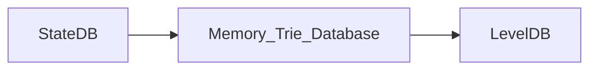

# State Management (1) : StateDB

## General

在本文中，我们剖析一下Ethereum State 管理模块中最重要的几个数据结构，StateDB, Trie，Secure Trie，以及StackTrie。我们讲通过分析Ethereum中的主workflow的方式来深入理解这三个数据结构的使用场景，以及设计上的不同。

首先，StateDB是这三个数据结构中最高层的封装，它是直接提供了与StateObject (Account，Contract)相关的CURD的接口给其他的模块，比如：

- Mining 模块，执行新Blockchain中的交易形成新的world state。
- Block同步模块，执行新Blockchain中的交易形成新的world state，与header中的state root进行比较验证。
- EVM中的两个与Contract中的持久化存储相关的两个opcode, sStore, sSload.

## StateDB

我们可以在genesis block创建的相关代码中，找到直接相关的例子。

```go
 statedb.Commit(false)
 statedb.Database().TrieDB().Commit(root, true, nil)
```

具体World State的更新顺序是:



StateDB 调用Commit的时候并没有同时触发TrieDB的Commit。

在Block被插入到Blockchain的这个Workflow中，stateDB的commit首先在`writeBlockWithState`函数中被调用了。之后`writeBlockWithState`函数会判断GC的状态来决定在本次调用中，是否需要向Disk Database写入数据。

### From Memory to Disk

当新的Block被添加到Blockchain时，State的数据并不一会立即被写入到Disk Database中。在`writeBlockWithState`函数中，函数会判断gc条件，只有满足一定的条件，才会在此刻调用TrieDB中的Cap或者Commit函数将数据写入Disk Database中。
