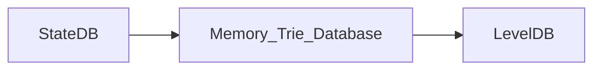

# State Management (1) : StateDB

写在前面: 在最新的 `geth` 代码库中，`SecureTrie` 已经被重命名为了 `StateTrie`，并且代码功能也进行了调整。因此，为了避免歧义，我们在这里提醒读者 **StateTrie 就是之前的 SecureTrie**。读者在阅读其他的文档时，如果遇到了 `SecureTrie`, 可以将其理解为 `StateTrie`。

## General

在本文中，我们剖析一下Ethereum State 管理模块中最重要的几个数据结构，StateDB, Trie，StateTrie，以及 StackTrie。我们讲通过分析Ethereum中的主workflow的方式来深入理解这三个数据结构的使用场景，以及设计上的不同。

首先，StateDB是这三个数据结构中最高层的封装，它是直接提供了与StateObject (Account，Contract)相关的 CURD 的接口给其他的模块，比如：

- Mining 模块，执行新 Blockchain 中的交易形成新的 world state。
- Block 同步模块，执行新 Blockchain 中的交易形成新的 world state，与header中的 state root 进行比较验证。
- EVM 中的两个与 Contract 中的持久化存储相关的两个 opcode, sStore, sSload.

## StateDB

我们可以在 genesis block 创建的相关代码中，找到直接相关的例子。

```go
 statedb.Commit(false)
 statedb.Database().TrieDB().Commit(root, true, nil)
```

具体World State的更新顺序是:



StateDB 调用 `Commit` 的时候并没有同时触发 `TrieDB` 的 Commit 。

在Block被插入到 Blockchain 的这个Workflow中，stateDB的commit首先在`writeBlockWithState`函数中被调用了。之后`writeBlockWithState`函数会判断 `GC` 的状态来决定在本次调用中，是否需要向 `Disk Database` 写入数据。

### From Memory to Disk

当新的Block被添加到Blockchain时，State 的数据并不一会立即被写入到 Disk Database 中。在`writeBlockWithState`函数中，函数会判断 `gc` 条件，只有满足一定的条件，才会在此刻调用 TrieDB 中的 `Cap` 或者 `Commit` 函数将数据写入Disk Database中。
