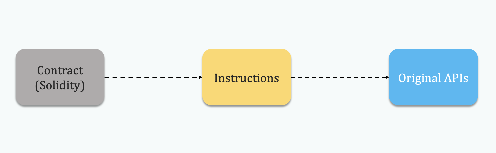

# 一个Transaction的生老病死/Transaction CRUD

## State-based Blockchain

- State-based Blockchain System 由两部分组成：World State 和 Blockchain。
- Blockchain是以块为单位的数据结构，每个块中包含了若干Transaction。
- Transaction是BlockchainSystem中与承载数据更新逻辑的载体。
- World State表示了System中所有Account的值的一个Snapshot。
- 这个Snapshot的建立是以Block为单位的。

## Transaction是如何被打包并修改Blockchain中的值的

Transaction是用于修改Account的State的。若干个Transaction对修改的结果整合成一个新的World State.

当miner开始构造新的区块的时候。首先调用 miner/worker.go的 mainLoop() 函数。

```go
func (w *worker) mainLoop() {
    ....
    coinbase := w.coinbase
    w.mu.RUnlock()

    txs := make(map[common.Address]types.Transactions)
    for _, tx := range ev.Txs {
        acc, _ := types.Sender(w.current.signer, tx)
        txs[acc] = append(txs[acc], tx)
    }
    txset := types.NewTransactionsByPriceAndNonce(w.current.signer, txs, w.current.header.BaseFee)
    tcount := w.current.tcount
    w.commitTransactions(txset, coinbase, nil)        
    ....
}
```

Worker会从TransactionPool中拿出若干的transaction, 赋值给*txs*, 然后按照Price和Nonce对*txs*进行排序，并将结果赋值给*txset*。

在拿到*txset*之后，mainLoop函数会调用miner/worker.go的commitTransactions()函数。

```go
func (w *worker) commitTransactions(txs *types.TransactionsByPriceAndNonce, coinbase common.Address, interrupt *int32) bool {
    ....

    // 首先给Block设置最大可以使用的Gas的上限
    gasLimit := w.current.header.GasLimit
    if w.current.gasPool == nil {
    w.current.gasPool = new(core.GasPool).AddGas(gasLimit)
    // 函数的主体是一个For循环
    for{
    .....
        // params.TxGas表示了transaction 需要的最少的Gas的数量
        // w.current.gasPool.Gas()可以获取当前block剩余可以用的Gas的Quota，如果剩余的Gas足以开启一个新的Tx，那么循环结束
        if w.current.gasPool.Gas() < params.TxGas {
            log.Trace("Not enough gas for further transactions", "have", w.current.gasPool, "want", params.TxGas)break
    }
    ....
    tx := txs.Peek()
    if tx == nil {
        break
    }
    ....
    logs, err := w.commitTransaction(tx, coinbase)
    ....
    }
}
```

commitTransactions()函数的主体是一个for循环，每次获取txs.Peek()的tx，并作为参数调用函数miner/worker.go的commitTransaction()

```go
func (w *worker) commitTransaction(tx *types.Transaction, coinbase common.Address) ([]*types.Log, error){
    // 在每次commitTransaction执行前都要记录当前StateDB的Snapshot,一旦交易执行失败则基于这个Snapshot进行回滚。
    // TODO StateDB如何进行快照(Snapshot)和回滚的
    snap := w.current.state.Snapshot()
    // 调用执行Transaction的函数
    receipt, err := core.ApplyTransaction(w.chainConfig, w.chain, &coinbase, w.current.gasPool, w.current.state, w.current.header, tx, &w.current.header.GasUsed, *w.chain.GetVMConfig())
    ....
}
```

Blockchain系统中的Transaction和DBMS中的Transaction一样，要么完成要么失败。所以在调用执行Transaction的函数前，首先记录了一下当前world state的Snapshot，当交易失败时回滚Transaction。之后调用core/state_processor.go/ApplyTransaction()函数。

```go
func ApplyTransaction(config *params.ChainConfig, bc ChainContext, author *common.Address, gp *GasPool, statedb *state.StateDB, header *types.Header, tx *types.Transaction, usedGas *uint64, cfg vm.Config) (*types.Receipt, error) {
    // 将Transaction 转化为Message的形式
    msg, err := tx.AsMessage(types.MakeSigner(config, header.Number), header.BaseFee)
    if err != nil {
        return nil, err
    }
    // Create a new context to be used in the EVM environment
    blockContext := NewEVMBlockContext(header, bc, author)
    vmenv := vm.NewEVM(blockContext, vm.TxContext{}, statedb, config, cfg)
    // 调用执行Contract的函数
    return applyTransaction(msg, config, bc, author, gp, statedb, header.Number, header.Hash(), tx, usedGas, vmenv)
}   
```

在 ApplyTransaction()函数中首先Transaction会被转换成Message的形式，方便调用。在执行每一个Transaction的时候，都会生成一个新的EVM来执行。之后调用core/state_processor.go/applyTransaction()函数来执行Message。


```go
func applyTransaction(msg types.Message, config *params.ChainConfig, bc ChainContext, author *common.Address, gp *GasPool, statedb *state.StateDB, blockNumber *big.Int, blockHash common.Hash, tx *types.Transaction, usedGas *uint64, evm *vm.EVM) (*types.Receipt, error) {
    ....
    // Apply the transaction to the current state (included in the env).
    result, err := ApplyMessage(evm, msg, gp)
    ....

}
```

之后调用core/state_transition.go/ApplyMessage()函数。

```go
func ApplyMessage(evm *vm.EVM, msg Message, gp *GasPool) (*ExecutionResult, error) {
    return NewStateTransition(evm, msg, gp).TransitionDb()
    }   
```

之后调用core/state_transition.go/TransitionDb()函数。

```go
// TransitionDb will transition the state by applying the current message and
// returning the evm execution result with following fields.
//
// - used gas:
//      total gas used (including gas being refunded)
// - returndata:
//      the returned data from evm
// - concrete execution error:
//      various **EVM** error which aborts the execution,
//      e.g. ErrOutOfGas, ErrExecutionReverted
//
// However if any consensus issue encountered, return the error directly with
// nil evm execution result.
func (st *StateTransition) TransitionDb() (*ExecutionResult, error) {
    ....
    ret, st.gas, vmerr = st.evm.Call(sender, st.to(), st.data, st.gas, st.value)
    ....
}
```

之后调用core/vm/evm.go/Call()函数。

```go
func (evm *EVM) Call(caller ContractRef, addr common.Address, input []byte, gas uint64, value *big.Int) (ret []byte, leftOverGas uint64, err error) {
    ....
    ret, err = evm.interpreter.Run(contract, input, false)
    ....
}
```

之后调用core/vm/interpreter.go/Run()函数。

```go
// Run loops and evaluates the contract's code with the given input data and returns
// the return byte-slice and an error if one occurred.
func (in *EVMInterpreter) Run(contract *Contract, input []byte, readOnly bool) (ret []byte, err error) {
    ....
    cost = operation.constantGas // For tracing
    // UseGas 函数：当前剩余的gas quota减去input 参数。
    // 剩余的gas 小于input直接返回false
    // 否则当前的gas quota减去input并返回true
    if !contract.UseGas(operation.constantGas) {
        return nil, ErrOutOfGas
        }
    ....
    // execute the operation
    res, err = operation.execute(&pc, in, callContext)
    ....

}
```
更细粒度的对每个opcode循环调用core/vm/jump_table.go中的execute函数。

每个OPCODE的具体实现在core/vm/instructor.go中,比如对Contract中持久化数据修改的OPSSTORE指令的实现位于opStore()函数中。

```go
func opSstore(pc *uint64, interpreter *EVMInterpreter, scope *ScopeContext) ([]byte, error) {
    loc := scope.Stack.pop()
    val := scope.Stack.pop()
    //根据指令跟地址来修改StateDB中某一存储位置的值。
    interpreter.evm.StateDB.SetState(scope.Contract.Address(),loc.Bytes32(), val.Bytes32())
    return nil, nil
}

//core/state/stateDB
func (s *StateDB) SetState(addr common.Address, key, value common.Hash) {
    stateObject := s.GetOrNewStateObject(addr)
    if stateObject != nil {
    stateObject.SetState(s.db, key, value)
    }
}
```

 这样就完成了从transaction到从StateDB中获取Code，然后修改StateDB中的值的闭环。

- commitTransactions ->> commitTransaction ->> ApplyTransaction ->> applyTransaction ->>  ApplyMessage ->> TransactionDB ->> Call  ->> Run ->> opSstore ->> StateDB ->> StateObject ->> Key-Value-Trie



## Reference

1. https://www.codenong.com/cs105936343/
2. https://yangzhe.me/2019/08/12/ethereum-evm/