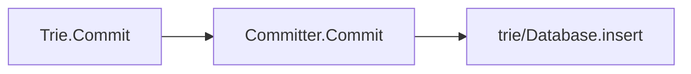

# 状态管理二: World State Trie and Storage Trie


## Trie 概述

Trie 结构是 Ethereum 中用于管理数据的基本数据结构，它被广泛的运用在Ethereum 里的多个模块中，包括管理全局的 World State Trie，管理 Contract中持久化存储的Storage Trie，以及每个 Block 中的与交易相关的 Transaction Trie 和 Receipt Trie。

在以太坊的体系中，广义上的 Trie 的指的是 Merkel Patricia Trie(MPT)这种数据结构。在实际的实现中，根据业务功能的不同，在 go-ethereum 中一共实现了三种不同的MPT的instance，分别是，`Trie`，`State Trie`(`Secure Trie`) 以及`Stack Trie`.

<!-- 这些Trie在具体实现上的不同点在于，Transaction Trie本质上并没有使用Trie来管理Transaction的数据，而是依赖于MPT的根来快速验证，具体可以参考core/types/hashing.go/DeriveSha()函数来了解Transaction Trie 的root是如何产生的，这里的Trie使用的是StackTrie。在本文中，我们主要研究的对象是与全局World State Trie有关的结构。 -->

从调用关系上看 `Trie` 是最底层的核心结构，它用于之间负责 StateObject 数据的保存，以及提供相应的 CURD 函数。它的定义在trie/trie.go文件中。

State Trie 结构本质上是对 Trie 的一层封装。它具体的CURD操作的实现都是通过`Trie`中定义的函数来执行的。它的定义在`trie/secure_trie.go`文件中。目前StateDB中的使用的Trie是经过封装之后的 State Trie。这个 Trie 也就是我们常说的World State Trie，它是唯一的一个全局 Trie 结构。与 Trie 不同的是，Secure Trie要求新加入的Key-Value pair中的Key 的数据都是Sha过的。这是为了方式恶意的构造Key来增加MPT的高度。

```go
type StateTrie struct {
 trie             Trie
 preimages        *preimageStore
 hashKeyBuf       [common.HashLength]byte
 secKeyCache      map[string][]byte
 secKeyCacheOwner *StateTrie // Pointer to self, replace the key cache on mismatch
}
```

不管是Secure Trie还是Trie，他们的创建的前提是: 更下层的db的实例已经创建成功了，否则就会报错。

值得注意的是一个关键函数Prove的实现，并不在这两个Trie的定义文件中，而是位于`trie/proof.go`文件中。

## Trie 运用

### Read Operation：读写行动

### Insert：插入

```go
func (t *Trie) insert(n node, prefix, key []byte, value node) (bool, node, error) {
 fmt.Println("Out n:", &n)
 if len(key) == 0 {
  if v, ok := n.(valueNode); ok {
   return !bytes.Equal(v, value.(valueNode)), value, nil
  }
  return true, value, nil
 }
 switch n := n.(type) {
 case *shortNode:
  matchlen := prefixLen(key, n.Key)
  // If the whole key matches, keep this short node as is
  if matchlen == len(n.Key) {
   dirty, nn, err := t.insert(n.Val, append(prefix, key[:matchlen]...), key[matchlen:], value)
   if !dirty || err != nil {
    return false, n, err
   }
   return true, &shortNode{n.Key, nn, t.newFlag()}, nil
  }
  // Otherwise branch out at the index where they differ.
  branch := &fullNode{flags: t.newFlag()}
  var err error
  _, branch.Children[n.Key[matchlen]], err = t.insert(nil, append(prefix, n.Key[:matchlen+1]...), n.Key[matchlen+1:], n.Val)
  if err != nil {
   return false, nil, err
  }
  _, branch.Children[key[matchlen]], err = t.insert(nil, append(prefix, key[:matchlen+1]...), key[matchlen+1:], value)
  if err != nil {
   return false, nil, err
  }
  // Replace this shortNode with the branch if it occurs at index 0.
  if matchlen == 0 {
   return true, branch, nil
  }
  // Otherwise, replace it with a short node leading up to the branch.
  return true, &shortNode{key[:matchlen], branch, t.newFlag()}, nil

 case *fullNode:
  dirty, nn, err := t.insert(n.Children[key[0]], append(prefix, key[0]), key[1:], value)
  if !dirty || err != nil {
   return false, n, err
  }
  n = n.copy()
  n.flags = t.newFlag()
  n.Children[key[0]] = nn
  return true, n, nil

 case nil:
  return true, &shortNode{key, value, t.newFlag()}, nil

 case hashNode:
  // We've hit a part of the trie that isn't loaded yet. Load
  // the node and insert into it. This leaves all child nodes on
  // the path to the value in the trie.
  rn, err := t.resolveHash(n, prefix)
  if err != nil {
   return false, nil, err
  }
  dirty, nn, err := t.insert(rn, prefix, key, value)
  if !dirty || err != nil {
   return false, rn, err
  }
  return true, nn, nil

 default:
  panic(fmt.Sprintf("%T: invalid node: %v", n, n))
 }
}
```

这里有一个关于go语言的知识：我们可以观察到insert函数的第一个参数是一个变量名为n的node类型的变量。有趣的是，在switch语句中我们看到了一个这样的写法：

```go
switch n := n.(type)
```

显然语句两端的*n*的含义并不相同。这种写法在go中是合法的。

### Update：更新

### Delete：删除

### Finalize And Commit to Disk：存储到硬盘

- 在leveldb中保存的是Trie中的节点。
- <hash, node.rlprawdata>

在Geth中，Trie并不是实时更新的，而是依赖于Committer和Database两个额外的辅助单位。



我们可以看到Trie的Commit并不会真的对Disk Database的值进行修改。

Trie真正更新到Disk Database的，是依赖于`trie/Database.Commit`函数的调用。我们可以在诸多函数中找到这个函数的调用比如。

```go
func GenerateChain(config *params.ChainConfig, parent *types.Block, engine consensus.Engine, db ethdb.Database, n int, gen func(int, *BlockGen)) ([]*types.Block, []types.Receipts) {
  ...
   // Write state changes to db
   root, err := statedb.Commit(config.IsEIP158(b.header.Number))
   if err != nil {
    panic(fmt.Sprintf("state write error: %v", err))
   }
   if err := statedb.Database().TrieDB().Commit(root, false, nil); err != nil {
    panic(fmt.Sprintf("trie write error: %v", err))
   }
   ...
}
```

## StackTrie

StackTrie虽然也是MPT结构，但是它与另外的两个Trie最大的不同在于，其主要作用不是用于存储数据，而是用于给一组数据生成证明。比如，在Block中的Transaction Hash以及Receipt Hash都是基于StackTrie生成的。这里我们使用一个更直观的例子。这个部分的代码位于*core/block_validator.go*中。在block_validator中定义了一系列验证用的函数, 比如`ValidateBody`和 `ValidateState`函数。我们选取了这两个函数的其中一部分，如下所示。为了验证Block的合法性，ValidateBody和ValidateState函数分别在本地基于Block中提供的数据来构造Transaction和Receipt的哈希来与Header中的TxHash与ReceiptHash。我们可以发现，函数`types.DeriveSha`需要一个`TrieHasher`类型的参数。但是在具体调用的时候，却传入了了一个`trie.NewStackTrie`类型的变量。这是因为StackTrie实现了TrieHasher接口所需要的三个函数，所以这种调用是合法的。我们可以在*core/types/hashing.go*中找到TrieHasher的定义。这里`DeriveSha`不断的向StackTrie中添加数据，并最终返回StackTrie的Root哈希值。

同时，我们可以发现，在调用DeriveSha函数的时候，我们每次都会new一个新的StackTrie作为参数。这也反映出了，StackTrie的主要作用就是生成验证用的Proof，而不是存储数据。

```golang
func (v *BlockValidator) ValidateBody(block *types.Block) error {
 ...
 if hash := types.DeriveSha(block.Transactions(), trie.NewStackTrie(nil)); hash != header.TxHash {
  return fmt.Errorf("transaction root hash mismatch: have %x, want %x", hash, header.TxHash)
 }
 ...
}
```

```golang
func (v *BlockValidator) ValidateState(block *types.Block, statedb *state.StateDB, receipts types.Receipts, usedGas uint64) error {
 ...
 // Tre receipt Trie's root (R = (Tr [[H1, R1], ... [Hn, Rn]]))
 receiptSha := types.DeriveSha(receipts, trie.NewStackTrie(nil))
 if receiptSha != header.ReceiptHash {
  return fmt.Errorf("invalid receipt root hash (remote: %x local: %x)", header.ReceiptHash, receiptSha)
 }
 ...
}

```

### FQA

#### State Trie的更新是什么时候发生的？
  
  State Trie的更新，通常是指的是基于State Trie中节点值的变化从而重新计算State Trie的Root的Hash值的过程。目前这一过程是通过调用StateDB中的`IntermediateRoot`函数来完成的。
  
  我们从三个粒度层面来看待State Trie更新的问题。

- Block 层：
    在一个新的Block Insert到Blockchain的过程中，State Trie可能会发生多次的更新。比如，在每次Transaction被执行之后，`IntermediateRoot`函数都会被调用。同时，更新后的 State Trie的Root值，会被写入到Transaction对应的Receipt中。请注意，在调用`IntermediateRoot`函数时，更新后的值在此时并没有被立刻写入到Disk Database中。此时的State Trie Root只是基于内存中的数据计算出来的。真正的Trie数据写盘，需要等到`trieDB.Commit`函数的执行。
- Transaction 层：
    如上面提到的，在每次Transaction执行完成后，系统都会调用一次StateDB的`IntermediateRoot`函数，来更新State Trie。并且会将更新后的Trie的Root Hash写入到该Transaction对应的Receipt中。这里提一下关于`IntermediateRoot`函数细节。在IntermediateRoot`函数调用时，会首先更新被修改的Contract的Storage Trie的Root。
- Instruction 层：
    执行Contract的Instruction，并不会直接的引发State Trie的更新。比如，我们知道，EVM指令`OpSstore`会修改Contract中的持久化存储。这个指令调用了StateDB中的`SetState`函数，并最终调用了对应的StateObject中的`setState`函数。StateObject中的`setState` 函数并没有直接对Contract的Storage Trie进行更新，而是将修改的存储对象保存在了StateObject中的*dirtyStorage* 中(*dirtyStorage*是用于缓存Storage Slot数据的Key-Value Map). Storage Trie的更新是由更上层的函数调用所触发的，比如`IntermediateRoot`函数，以及`StateDB.Commit`函数。

## Reference

- [1] <http://yangzhe.me/2019/01/18/ethereum-trie-part-2/>
