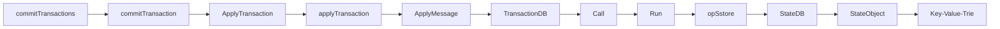

# Transaction: 一个Transaction的生老病死

## 概述

我们知道，Ethereum的基本模型是基于交易的状态机模型(Transaction-based State Machine)。在[Account章节](./01_account.md)我们简述了一下Account/State的基本结构。本章我们就来探索一下，Ethereum基本模型中的另一个基本数据单元Transaction。在本文中，我们提到的交易指的是在Ethereum Layer-1层面上构造的交易，以太坊生态中的Layer-2中的交易不在我们的讨论中。

首先，Transaction是Ethereum执行数据操作的媒介。它主要起到下面的几个作用:

1. 在Layer-1网络上的Account之间进行Native Token的转账。
2. 创建新的Contract。
3. 调用Contract中会修改目标Contract中持久化数据或者间接修改其他Account/Contract数据的函数。

这里我们对Transaction功能性的细节再进行一些额外的补充说明。首先，Transaction只能创建Contract账户，而不能用于创建外部账户(EOA)。其次，如果调用的Contract函数只进行了查询的操作，是不需要构造依赖Transaction的。而所有参与Account/Contract数据修改的操作都需要通过Transaction来进行。第三，广义上的Transaction只能由外部账户(EOA)构建。Contract是没有办法显式构造Layer-1层面的交易的。在某些合约函数的执行过程中，Contract在可以通过构造internal transaction来与其他的合约进行交互，但是这种Internal transaction与我们提到的Layer-1层面的交易有所不同，我们会在之后的章节介绍。

## LegacyTx & AccessListTX & DynamicFeeTx

下面我们根据源代码中的Transaction的定义来了解一下Transaction的数据结构。Transaction结构体的定义位于*core/types/transaction.go*中。Transaction的结构体如下所示。

```go
type Transaction struct {
 inner TxData    // Consensus contents of a transaction
 time  time.Time // Time first seen locally (spam avoidance)

 // caches
 hash atomic.Value
 size atomic.Value
 from atomic.Value
}
```

从代码定义中我们可以看到，Transaction的结构体是非常简单的结构，它只包含了五个变量分别是, `TxData`类型的inner，`Time`类型的time，以及三个`atomic.Value`类型的hash，size，以及from。这里我们需要重点关注一下`inner`这个变量。目前与Transaction直接相关的数据都由这个变量来维护。

目前，`TxData`类型是一个接口，它的定义如下面的代码所示。

```go
type TxData interface {
 txType() byte // returns the type ID
 copy() TxData // creates a deep copy and initializes all fields

 chainID() *big.Int
 accessList() AccessList
 data() []byte
 gas() uint64
 gasPrice() *big.Int
 gasTipCap() *big.Int
 gasFeeCap() *big.Int
 value() *big.Int
 nonce() uint64
 to() *common.Address

 rawSignatureValues() (v, r, s *big.Int)
 setSignatureValues(chainID, v, r, s *big.Int)
}
```

这里注意，在目前版本的geth中(1.10.*)，根据[EIP-2718][EIP2718]的设计，原来的TxData现在被声明成了一个interface，而不是定义了具体的结构。这样的设计好处在于，后续版本的更新中可以对Transaction类型进行更加灵活的修改。目前，在Ethereum中定义了三种类型的Transaction来实现TxData这个接口。按照时间上的定义顺序来说，这三种类型的Transaction分别是，LegacyT，AccessListTx，TxDynamicFeeTx。LegacyTx顾名思义，是原始的Ethereum的Transaction设计，目前市面上大部分早年关于Ethereum Transaction结构的文档实际上都是在描述LegacyTx的结构。而AccessListTX是基于EIP-2930(Berlin分叉)的Transaction。DynamicFeeTx是[EIP-1559](https://eips.ethereum.org/EIPS/eip-1559)(伦敦分叉)生效之后的默认的Transaction。

(PS:目前Ethereum的黄皮书只更新到了Berlin分叉的内容，还没有添加London分叉的更新, 2022.3.10)

### LegacyTx

```go
type LegacyTx struct {
 Nonce    uint64          // nonce of sender account
 GasPrice *big.Int        // wei per gas
 Gas      uint64          // gas limit
 To       *common.Address `rlp:"nil"` // nil means contract creation
 Value    *big.Int        // wei amount
 Data     []byte          // contract invocation input data
 V, R, S  *big.Int        // signature values
}
```

### AccessListTX

```go
type AccessListTx struct {
 ChainID    *big.Int        // destination chain ID
 Nonce      uint64          // nonce of sender account
 GasPrice   *big.Int        // wei per gas
 Gas        uint64          // gas limit
 To         *common.Address `rlp:"nil"` // nil means contract creation
 Value      *big.Int        // wei amount
 Data       []byte          // contract invocation input data
 AccessList AccessList      // EIP-2930 access list
 V, R, S    *big.Int        // signature values
}
```

### DynamicFeeTx

如果我们观察DynamicFeeTx就会发现，DynamicFeeTx的定义其实就是在LegacyTx/AccessListTX的定义的基础上额外的增加了GasTipCap与GasFeeCap这两个字段。

```go
type DynamicFeeTx struct {
 ChainID    *big.Int
 Nonce      uint64
 GasTipCap  *big.Int // a.k.a. maxPriorityFeePerGas
 GasFeeCap  *big.Int // a.k.a. maxFeePerGas
 Gas        uint64
 To         *common.Address `rlp:"nil"` // nil means contract creation
 Value      *big.Int
 Data       []byte
 AccessList AccessList

 // Signature values
 V *big.Int `json:"v" gencodec:"required"`
 R *big.Int `json:"r" gencodec:"required"`
 S *big.Int `json:"s" gencodec:"required"`
}
```

## Transaction的执行

Transaction的执行主要在发生在两个Workflow中:

1. Miner在打包新的Block时。此时Miner会按Block中Transaction的打包顺序来执行其中的Transaction。
2. 其他节点添加Block到Blockchain时。当节点从网络中监听并获取到新的Block时，它们会执行Block中的Transaction，来更新本地的State Trie的 Root，并与Block Header中的State Trie Root进行比较，来验证Block的合法性。

一条Transaction执行的结果，可能会造成一个或多个Account的State的变化。最终一个Block中所有Transaction执行的结果使得World State发生状态转移。下面我们就来分析一下一条Transaction是怎么造成World State 发生变化的。

### Native Token Transferring Transaction

### Transaction修改Contract的持久化存储的


在Ethereum中，当Miner开始构造新的区块的时候，首先会启动*miner/worker.go*的 `mainLoop()`函数。具体的函数如下所示。

```go
func (w *worker) mainLoop() {
    ....
    // 设置接受该区块中挖矿奖励的账户地址
    coinbase := w.coinbase
    w.mu.RUnlock()

    txs := make(map[common.Address]types.Transactions)
    for _, tx := range ev.Txs {
        acc, _ := types.Sender(w.current.signer, tx)
        txs[acc] = append(txs[acc], tx)
    }
    // 这里看到，通过NewTransactionsByPriceAndNonce获取一部分的Tx并打包
    txset := types.NewTransactionsByPriceAndNonce(w.current.signer, txs, w.current.header.BaseFee)
    tcount := w.current.tcount
    //提交打包任务
    w.commitTransactions(txset, coinbase, nil)        
    ....
}
```

在Mining新区块前，Worker首先需要决定，那些Transaction会被打包到新的Block中。这里选取Transaction其实经历了两个步骤。首先，`txs`变量保存了从Transaction Pool中拿去到的合法的，以及准备好被打包的交易。这里举一个例子，来说明什么是**准备好被打包的交易**，比如Alice先后发了新三个交易到网络中，对应的Nonce分别是100和101，102。假如Miner只收到了100和102号交易。那么对于此刻的Transaction Pool来说Nonce 100的交易就是**准备好被打包的交易**，交易Nonce 是102需要等待Nonce 101的交易被确认之后才能提交。

在Worker会从Transaction Pool中拿出若干的transaction, 赋值给*txs*之后, 然后调用`NewTransactionsByPriceAndNonce`函数按照Gas Price和Nonce对*txs*进行排序，并将结果赋值给*txset*。在拿到*txset*之后，mainLoop函数会调用`commitTransactions`函数，正式进入Mining新区块的流程。`commitTransactions`函数如下所示。


```go
func (w *worker) commitTransactions(txs *types.TransactionsByPriceAndNonce, coinbase common.Address, interrupt *int32) bool {
    ....

    // 首先给Block设置最大可以使用的Gas的上限
    gasLimit := w.current.header.GasLimit
    if w.current.gasPool == nil {
    w.current.gasPool = new(core.GasPool).AddGas(gasLimit)
    // 函数的主体是一个For循环
    for{
    .....
        // params.TxGas表示了transaction 需要的最少的Gas的数量
        // w.current.gasPool.Gas()可以获取当前block剩余可以用的Gas的Quota，如果剩余的Gas足以开启一个新的Tx，那么循环结束
        if w.current.gasPool.Gas() < params.TxGas {
            log.Trace("Not enough gas for further transactions", "have", w.current.gasPool, "want", params.TxGas)break
    }
    ....
    tx := txs.Peek()
    if tx == nil {
        break
    }
    ....
    // 提交单条Transaction 进行验证
    logs, err := w.commitTransaction(tx, coinbase)
    ....
    }
}
```

`commitTransactions`函数的主体是一个for循环，每次获取结构体切片头部的txs.Peek()的transaction，并作为参数调用函数miner/worker.go的`commitTransaction()`。`commitTransaction()`函数如下所示。

```go
func (w *worker) commitTransaction(tx *types.Transaction, coinbase common.Address) ([]*types.Log, error){
    // 在每次commitTransaction执行前都要记录当前StateDB的Snapshot,一旦交易执行失败则基于这个Snapshot进行回滚。
    // TODO StateDB如何进行快照(Snapshot)和回滚的
    snap := w.current.state.Snapshot()
    // 调用执行Transaction的函数
    receipt, err := core.ApplyTransaction(w.chainConfig, w.chain, &coinbase, w.current.gasPool, w.current.state, w.current.header, tx, &w.current.header.GasUsed, *w.chain.GetVMConfig())
    ....
}
```

Blockchain系统中的Transaction和DBMS中的Transaction一样，要么完成要么失败。所以在调用执行Transaction的函数前，首先记录了一下当前world state的Snapshot，用于交易失败时回滚操作。之后调用core/state_processor.go/ApplyTransaction()函数。

```go
func ApplyTransaction(config *params.ChainConfig, bc ChainContext, author *common.Address, gp *GasPool, statedb *state.StateDB, header *types.Header, tx *types.Transaction, usedGas *uint64, cfg vm.Config) (*types.Receipt, error) {
    // 将Transaction 转化为Message的形式
    msg, err := tx.AsMessage(types.MakeSigner(config, header.Number), header.BaseFee)
    if err != nil {
        return nil, err
    }
    // Create a new context to be used in the EVM environment
    blockContext := NewEVMBlockContext(header, bc, author)
    vmenv := vm.NewEVM(blockContext, vm.TxContext{}, statedb, config, cfg)
    // 调用执行Contract的函数
    return applyTransaction(msg, config, bc, author, gp, statedb, header.Number, header.Hash(), tx, usedGas, vmenv)
}   
```

在 ApplyTransaction()函数中首先Transaction会被转换成Message的形式。在执行每一个Transaction的时候，都会生成一个新的EVM来执行。之后调用core/state_processor.go/applyTransaction()函数来执行Message。

```go
func applyTransaction(msg types.Message, config *params.ChainConfig, bc ChainContext, author *common.Address, gp *GasPool, statedb *state.StateDB, blockNumber *big.Int, blockHash common.Hash, tx *types.Transaction, usedGas *uint64, evm *vm.EVM) (*types.Receipt, error) {
    ....
    // Apply the transaction to the current state (included in the env).
    result, err := ApplyMessage(evm, msg, gp)
    ....

}
```

之后调用core/state_transition.go/ApplyMessage()函数。

```go
func ApplyMessage(evm *vm.EVM, msg Message, gp *GasPool) (*ExecutionResult, error) {
    return NewStateTransition(evm, msg, gp).TransitionDb()
    }   
```

之后调用core/state_transition.go/TransitionDb()函数。

```go
func (st *StateTransition) TransitionDb() (*ExecutionResult, error) {
    ....
    ret, st.gas, vmerr = st.evm.Call(sender, st.to(), st.data, st.gas, st.value)
    ....
}
```

之后调用core/vm/evm.go/Call()函数。

```go
func (evm *EVM) Call(caller ContractRef, addr common.Address, input []byte, gas uint64, value *big.Int) (ret []byte, leftOverGas uint64, err error) {
    ....
    // Execute the contract
    ret, err = evm.interpreter.Run(contract, input, false)
    ....
}
```

之后调用core/vm/interpreter.go/Run()函数。

```go
// Run loops and evaluates the contract's code with the given input data and returns
// the return byte-slice and an error if one occurred.
func (in *EVMInterpreter) Run(contract *Contract, input []byte, readOnly bool) (ret []byte, err error) {
    ....
    cost = operation.constantGas // For tracing
    // UseGas 函数：当前剩余的gas quota减去input 参数。
    // 剩余的gas 小于input直接返回false
    // 否则当前的gas quota减去input并返回true
    if !contract.UseGas(operation.constantGas) {
        return nil, ErrOutOfGas
        }
    ....
    // execute the operation
    res, err = operation.execute(&pc, in, callContext)
    ....

}
```

在更细粒度的层面，每个opcode循环调用core/vm/jump_table.go中的execute函数。这里值得一提的是，获取Contract中每条Operate的方式，是从Contact中的code数组中按照第n个拿取。

```go
// GetOp returns the n'th element in the contract's byte array
func (c *Contract) GetOp(n uint64) OpCode {
 return OpCode(c.GetByte(n))
}

// GetByte returns the n'th byte in the contract's byte array
func (c *Contract) GetByte(n uint64) byte {
 if n < uint64(len(c.Code)) {
  return c.Code[n]
 }

 return 0
}
```

OPCODE的具体实现代码位于core/vm/instructor.go文件中。比如，对Contract中持久化数据修改的OPSSTORE指令的实现位于opStore()函数中。而opStore的函数的具体操作又是调用了StateDB中的SetState函数，将Go-ethereum中的几个主要的模块串联了起来。

```go
func opSstore(pc *uint64, interpreter *EVMInterpreter, scope *ScopeContext) ([]byte, error) {
    loc := scope.Stack.pop()
    val := scope.Stack.pop()
    //根据指令跟地址来修改StateDB中某一存储位置的值。
    interpreter.evm.StateDB.SetState(scope.Contract.Address(),loc.Bytes32(), val.Bytes32())
    return nil, nil
}

//core/state/stateDB
func (s *StateDB) SetState(addr common.Address, key, value common.Hash) {
    stateObject := s.GetOrNewStateObject(addr)
    if stateObject != nil {
    stateObject.SetState(s.db, key, value)
    }
}

对于一条调用合约函数的交易，其中必然会存在修改StateDB的操作。通过上述的函数调用关系，我们就完成了在一个新区块的形成过程中，Transaction如何修改StateDB的Workflow。




## [Validator] 验证节点是如何执行Transaction来更新World State

而对于不参与Mining的节点，他们执行Block中Transaction的入口是在core/blockchain.go中的InsertChain()函数。InsertChain函数通过调用内部函数insertChain，对调用中的core/state_processor.go中的Process()函数。Process函数的核心在于循环遍历Block中的Transaction，调用上述的applyTransaction函数。从这里开始更底层的调用关系就与Mining Workflow中的调用关系相同。

```go
// Process processes the state changes according to the Ethereum rules by running
// the transaction messages using the statedb and applying any rewards to both
// the processor (coinbase) and any included uncles.
//
// Process returns the receipts and logs accumulated during the process and
// returns the amount of gas that was used in the process. If any of the
// transactions failed to execute due to insufficient gas it will return an error.
func (p *StateProcessor) Process(block *types.Block, statedb *state.StateDB, cfg vm.Config) (types.Receipts, []*types.Log, uint64, error) {
 var (
  receipts    types.Receipts
  usedGas     = new(uint64)
  header      = block.Header()
  blockHash   = block.Hash()
  blockNumber = block.Number()
  allLogs     []*types.Log
  gp          = new(GasPool).AddGas(block.GasLimit())
 )
 // Mutate the block and state according to any hard-fork specs
 if p.config.DAOForkSupport && p.config.DAOForkBlock != nil && p.config.DAOForkBlock.Cmp(block.Number()) == 0 {
  misc.ApplyDAOHardFork(statedb)
 }
 blockContext := NewEVMBlockContext(header, p.bc, nil)
 vmenv := vm.NewEVM(blockContext, vm.TxContext{}, statedb, p.config, cfg)
 // Iterate over and process the individual transactions
 for i, tx := range block.Transactions() {
  msg, err := tx.AsMessage(types.MakeSigner(p.config, header.Number), header.BaseFee)
  if err != nil {
   return nil, nil, 0, fmt.Errorf("could not apply tx %d [%v]: %w", i, tx.Hash().Hex(), err)
  }
  statedb.Prepare(tx.Hash(), i)
  //核心: 与Mining中Commit Transaction不同，Process在外部循环Block中的Transaction并单条执行。
  receipt, err := applyTransaction(msg, p.config, p.bc, nil, gp, statedb, blockNumber, blockHash, tx, usedGas, vmenv)
  if err != nil {
   return nil, nil, 0, fmt.Errorf("could not apply tx %d [%v]: %w", i, tx.Hash().Hex(), err)
  }
  receipts = append(receipts, receipt)
  allLogs = append(allLogs, receipt.Logs...)
 }
 // Finalize the block, applying any consensus engine specific extras (e.g. block rewards)
 p.engine.Finalize(p.bc, header, statedb, block.Transactions(), block.Uncles())

 return receipts, allLogs, *usedGas, nil
}
```

## Background of State-based Blockchain

- State-based Blockchain 的数据主要由两部分的数据管理模块组成：World State 和 Blockchain。
- State Object是系统中基于K-V结构的基础数据元素。在Ethereum中，State Object是Account。
- World State表示了System中所有State Object的最新值的一个Snapshot，。
- Blockchain是以块为单位的数据结构，每个块中包含了若干Transaction。Blockchain 可以被视为历史交易数据的组合。
- Transaction是Blockchain System中与承载数据更新的载体。通过Transaction，State Object从当前状态切换到另一个状态。
- World State的更新是以Block为单位的。

1. <https://www.codenong.com/cs105936343/>
2. <https://yangzhe.me/2019/08/12/ethereum-evm/>

[EIP2718]: https://eips.ethereum.org/EIPS/eip-2718