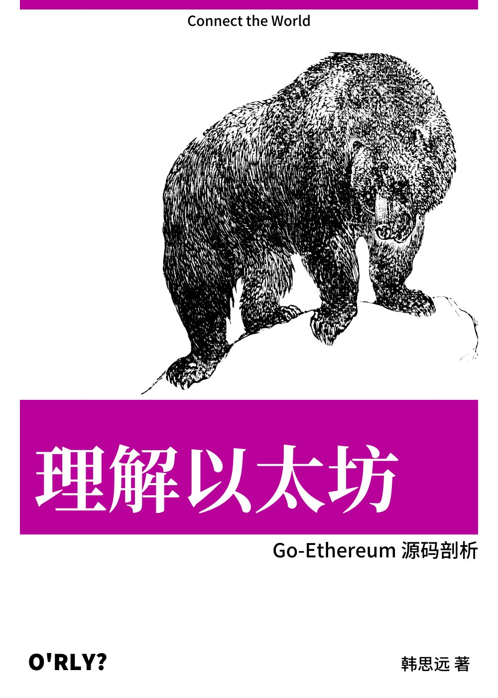

# Understanding-Ethereum-Go-version

- Title: Understanding Ethereum: Go-ethereum Source Code Analysis｜理解以太坊: Go-Ethereum 源码剖析
- Subject: Ethereum Source Code Analysis | 以太坊源码剖析
- Author: [Siyuan Han](https://home.cse.ust.hk/~shanaj/)
- Go-Ethereum Version: v1.10.25 (Post-Merge)
- Updated date: 2022-11
- Contact: [Twitter](https://twitter.com/cyodyssey) & Wechat(hsyodyssey)
- ACK: My Wife & The great Scroll team and ABCDE Capital

-----------------------------------------------------------

## 前言 (Preface)

### 写作背景

#### 时代的弄潮儿: Blockchain

Blockchain 最早作为支撑 Bitcoin 结算的分布式账本技术，由中本聪在**比特币白皮书**提出，至今已经过了十几年。在这十几年中，随着加密货币价格的飞涨，区块链社区的参与人数不断的增加，大量的来自不同背景专业人士给 Blockchain 这一概念源源不断的注入新的想法。随着新的思想持续的涌入，区块链技术的边界不断的拓展，逐渐成为了融合了*数据库*，*分布式系统*，*密码学*，*点对点网络*，*编译原理*，*静态软件分析*，*众包*，*经济学*，*货币金融学*，*社会学*等多个学科知识的一个全新技术领域。在源源不断的新技术催化下，Blockchain 也逐渐从小众的去中心化技术社区逐渐走向了主流社会的舞台，至今仍是当下**最热度最高**，**技术迭代最快**，**最能引起社会讨论**的技术话题之一。在 Blockchain 原生的 decentralized 的思想的影响下，市面上绝大多数的 Blockchain 系统都已经开源，并以开源的形式持续在 Github 上维护。这就为我们提供了一种的极好的学习 Blockchain 技术的方式: 结合文档，基于源代码，理解和学习系统的设计思想和实现原理。

#### 为什么要研究以太坊& Go-Ethereum 的原理

从基础建设的角度看，随着网络基础建设的不断完善，网络带宽增加和通信延迟下降的趋势将会持续。伴随着存储技术和分布式算法的不断发展，未来软件系统的运行效率将会持续的提高，并且会逐渐逼近硬件设备的性能极限。这些技术的发展对构建大规模去中心化应用带来更大的确定性。在未来的五到十年内，云端服务/去中心化系统的性能以及覆盖场景一定还会有很大的提升。未来的技术世界会是两极分化的。一极是以大型科技公司（i.e, Google，MS，Oracle，Snowflake，and Alibaba）为代表的中心化服务商。另一极就是以 Blockchain 技术作为核心的去中心化的世界。在这个世界中，Ethereum 及其生态系统是当之无愧的领头羊。Ethereum 作为通用型 Public Chain 中的翘楚构建了稳定强大的生态系统。Ethereum 及其生态吸引到了一大批世界上最优秀的工程师和研究人员的持续的输出。不断的将新思想，新理念，新技术引入到 Ethereum 及其生态中，并且持续的引领整个 Blockchain 生态系统发展。从计算机技术的发展史上看，优秀的平台化的开源项目，例如 Linux，Android，拥有强大的生命力。由于这类项目的代码经过时间的验证，会有源源不断的开发人员基于这些项目的代码库来开发全新的应用。Go-Ethereum 作为 Ethereum 的优秀稳健的开源实现，目前已经被广泛的订制，被应用在了多种私有/联盟/Layer-2的场景中(e.g., Quorum, Binance Smart Chain, [Scroll](https://scroll.io/), Arbitrum , Optimism)。不管是哪种场景，Ethereum 的相关代码总是位于系统的核心中的核心位置。因此，作为开发人员/研究人员理解 Ethereum 的设计和实现是至关重要的。

#### 本书的写作目的

一个热门的技术是否热门的标志之一是: 是否有不同视角的作者，在不同的技术发展阶段记录下来的文档资料。目前，对于学习者，不管是探究以加密货币导向（Crypto-based）的Bitcoin, 还是了解致力于实现通用 Web3 框架（General-Purpose）的 Ethereum，社区中有丰厚的 high-level 的角度的技术文档来讲述它们的基础概念和设计的思想。比如，技术社区有非常多的资料来讲述什么是梅克尔树 (Merkle Hash Tree)，什么是梅克尔帕特里夏树 (Merkle Patricia Trie)，什么是有向无环图 (Directed acyclic Graph); BFT (Byzantine Fault Tolerance)和 PoW (Proof-Of-Work) 共识算法算法的区别; 以及介绍Blockchain系统为什么可以抵抗双花攻击 (Double-Spending)，或者为什么Ethereum会遇到 DAO Attack (Decentralized autonomous organization) 等具体问题。

但是，现有的资料往往对工程实现的细节介绍的不够清晰。对于研究人员和开发人员来说，只了解关键组件的实现细节，或者高度抽象的系统工作流，并不代表着搞清楚 Blockchain 的**工作原理**。反而很容易在一些关键细节上一头雾水，似懂非懂。比如，当我们谈到 Ethereum 中 Transaction 的生命周期时，翻阅文档时经常会看到类似的说法，“Miner 节点批量地从自己维护的 Transaction pool 中选择一些 Transaction 并打包成一个新的 Block 中”。那么究竟 Miner 是怎么从网络中获取到 Transaction？又是基于什么样的策略从 Transaction pool 中选取**多少** Transaction？最终又按照什么样的 Order 把 Transaction 打包进区块中的呢？打包成功的 Block 是怎么交互/传播给其他节点呢？我搜索了大量的文档，发现鲜有文章详细的解释了上述的问题。因此我们需要一些文章从*整体*的系统工作流的角度出发，以**细粒度**的视角对区块链系统中的具体的实现*细节*进行解析。与数据库系统(Database Management System)相似，Blockchain 系统同样是一个包含网络层，业务逻辑层，任务解析层，存储层的复杂数据管理系统。对它研究同样需要从系统的实现细节出发，从宏观到微观的了解每个执行逻辑的工作流，才能彻底理解和掌握这门技术的秘密。


本系列文章作为我在博士期间学习/研究的记录，将会从 Ethereum 执行层中具体业务的工作的视角出发，在源码的层面，细粒度地解析以太坊系统中各个模块的实现的细节，以及背后的蕴含的技术和设计思想。同时，在阅读源代码中发现的问题也可以提交 Pr 来贡献社区。由于 Go-ethereum 的代码库在持续的更新，源码分析的文档很难持续追踪最新的代码库。因此，本系列文档选择基于 Go-ethereum version 1.10.*(post-merge)版本。Go-ethereum是以太坊协议的 Go 语言实现版本，目前由以太坊基金会维护。目前除了 Go-ethereum 之外，Ethereum 还有C++, Python，Java, Rust 等基于其他语言实现的版本。相比于其他的由社区维护的版本，Go-ethereum 的用户数量最多，开发人员最多，版本更新最频繁，issues 的发现和处理都较快。其他语言的 Ethereum实现版本因为用户与开发人员的数量相对较少，更新频率相对较低，隐藏问题出现的可能性更高。同时 Go 语言语法简单，容易阅读。对于没有 Go 语言开发经验的读者，仍然可以快速的理解代码功能。因此我们选择从 Go-ethereum 代码库作为我们的主要学习资料。

在合并之后，以太坊信标链和原有的主链进行了合并。原有的主链节点 (Go-ethereum 节点) 进行了功能缩减，放弃了共识相关的功能，仅作为执行层继续在以太坊的生态中发挥至关重要的作用。同时，交易的执行，状态的维护，数据的存储等基本功能还是由执行层进行维护。因此，作为开发和研究人员，了解 Go-ethereum 代码库仍然是十分有意义的。

### 我们为什么要阅读区块链系统的源代码？

1. 关于以太坊细节实现的文档资料相对较少。由于 Ethereum 进行了多次设计上的更新，一些源代码解析的文章中采用的代码已经经历了多次的修改。同时，不少文章在分析细节的时候，浅尝辄止，对一些关键问题没有解析到位。比如，*很多的科普文章都提到，在打包新的Block的时候，miner负责把a batch of transactions从transaction pool中打包到新的block中*。那么我们希望读者思考如下的几个问题：
    - Miner 是从什么方式获取到待打包的 Transactions?   
    - Miner 是基于什么样策略从 Transaction Pool 中选择 Transaction 呢？
    - 被选择的 Transactions 又是以怎样的顺序(Order)被打包到区块中的呢？
    - 在执行 Transaction 的 EVM 是怎么计算 gas used，从而限定 Block 中Transaction 的数量?
    - 剩余的 gas 又是怎么返还给 Transaction Proposer 的呢？
    - EVM 是怎么解释 Contract 的 Message Call 并执行的呢？
    - 在执行 Transaction 时，是什么模块，怎样去修改 Contract 中持久化变量？
    - Smart Contract 中的持久化变量是以什么样的形式存储？又是存储在什么地方？
    - 当新的 Block 更新到 Blockchain 中时，World State 又是在什么时机，以什么方式更新的呢？
    - 哪些数据常驻内存，哪些数据需要保存在 Disk 中呢？
  
2. 目前的 Blockchain 系统并没有像数据库系统(DBMS)那样统一的形成系统性的方法论。在 Ethereum 中每个不同的模块中都集成了大量的细节。从源码的角度出发可以了解到很多容易被忽视的细节。简单的说，一个完整的区块链系统至少包含以下的模块:
    - 密码学模块: 加解密，签名，安全hash，Mining
    - 网络模块: P2P节点通信
    - 分布式共识模块: PoW, BFT，PoA
    - 智能合约解释器模块: Solidity编译语言，EVM解释器
    - 数据存储模块: 状态数据库，Caching，数据存储，Index，LevelDB
    - Log日志模块
    - etc.

而在具体实现中，由于设计理念，以及 go 语言的特性(没有继承派生关系)，Go-ethereum中的模块之间相互调用关系相对复杂。因此，只有通过阅读源码的方式才能更好理解不同模块之间的调用关系，以及业务流程中的关键细节。

-----------------------------------------------------------

## 目录Contents (暂定)

### PART ONE - General Source Code Analysis: Basic Workflow and Data Components

- [00_万物的起点: Geth Start](CN/00_geth.md)
- [01_Basic data strucutre: Account and State](CN/01_account_state.md)
- [02_State Management i: StateDB](CN/02_state_management_statedb.md)
- [03_State Management ii: World State Trie and Storage Trie](CN/03_state_management_stateTrie.md)
- [WIP] [04_Basic data strucutre: Transaction | 一个Transaction的生老病死](CN/04_transaction.md)
- [WIP] [05_Basic data strucutre: Block | 从Block到Blockchain](CN/05_block_blockchain.md)
- [WIP] [06_一个网吧老板是怎么用闲置的电脑进行挖矿的]
- [WIP] [07_How nodes connect to others](CN/07_p2p_net_node_sync.md)
- [WIP] [08_Get transactions and blocks from peers](CN/08_sync.md)

### PART TWO - General Source Code Analysis: Lower-level Services

- [10_State数据优化: Batch and Pruning]
- [11_Blockchain 的数据是如何持久化的: Leveldb in Practice]
- [12_当I/O变成瓶颈: Caching in Practice]
- [WIP] [13_深入 EVM: 设计与实现](CN/13_evm.md)
- [14_Signer: 如何保证 Transaction 的合法性]
- [WIP] [15_节点的调用 RPC and IPC](CN/15_rpc.md)

### PART THREE - Advanced Topics

- [20_结合BFT Consensus 解决拜占庭将军问题]
- [WIP] [21_从Plasma到Rollup](CN/21_rollup.md)
- [WIP] [22_Authenticated data structures Brief](CN/22_ads.md)
- [WIP] [23_Bloom Filter](CN/23_bloom_filter.md)
- [24_图灵机和停机问题]
- [WIP] [25_Log-structured merge-tree in Ethereum](CN/25_lsm_tree.md)
- [WIP] [26_Concurrency in Ethereum Transaction](CN/26_txn_concurrency.md)
- [27_Zero-knowledge Proof]

### PART FOUR - Ethereum in Practice

- [WIP] [30_使用geth构建一个私有网络](CN/30_geth_private_network.md)
- [WIP] [31_如何编写Solidity语言](CN/31_solidity_in_practice.md)
- [32_使用预言机(Oracle)构建随机化的DApp]
- [33_Query On Ethereum Data]
- [34_layer2 in Practice]

### PART FIVE - APPENDIX

- [40_FQA](#tips)
- [41_Ethereum System Tunning]
- [42_go-ethereum的开发思想]
- [43_Metrics in Ethereum]
- [44_Merge](CN/44_merge.md)
- [WIP] [45_Scroll](CN/45_scroll.md)
- [WIP] [46_Arbitrum](CN/46_arbitrum.md)

-----------------------------------------------------------

## How to measure the level of understanding of a system？

如何衡量对一个系统的理解程度?

- Level 4: 掌握（Mastering）
  - 在完全理解的基础上，可以设计并编写一个全新的系统
  - 根据实际需求，重写系统模块
  - 可以使用另一种编程语言重新复现本系统
- Level 3: 完全理解（Complete Understanding）
  - 在理解的基础上，完全掌握系统各个模块实现的细节
  - 能快速的从系统功能模块定位到其对应的代码库的位置
  - 可以将系统定制化到不同的应用场景
  - 能对系统中的各个模块做出优化
- Level 2: 理解（Understanding）
  - 熟练使用系统的常用 API
  - 了解系统各个模块的调用关系
  - 了解部分核心模块的设计细节
  - 能对系统的部分模块进行简单修改/重构
- Level 1:了解（Brief understanding）
  - 了解系统设计的主要目标
  - 了解系统的应用场景
  - 了解系统的主要功能
  - 可以使用系统的部分的 API

 我们希望读者在阅读完本系列之后，对以太坊的理解能够达到 Level 2 - Level 3 的水平。

## Some Details

- 以太坊是基于 State 状态机模型的区块链系统，交易的结果会直接更新到账户的状态上。因此，在 Miner 生成新的区块的时候，会直接调用 EVM 中增加余额的函数，添加区块奖励给自己。因此，与 Bitcoin 不同的是，Ethereum 的区块中，并没有额外增加 Coinbase 的 transaction。
- 在 core/transaction.go 中, transaction 数据结构的定义中包含了一个 time.Time 类型的成员变量。在后续创建一个新的 Transaction 的 newTransaction 函数中，只使用 Local time(`time.now()`)对 Transaction.time 进行初始化。
- 被打包到 Uncle block 中的 transaction 不会被更新到包含该叔块的主链区块中。
- 不同的合约中的数据会混合的保存在底层的同一个 LevelDB instance 中。
- LevelDB 中保存的 KV-Pair 是 MPT 的 Node 信息，包括 State Trie 和 Storage Trie。
- 在以太坊更新数据的工作流中，通常先调用 `Finalise` 函数，然后执行`Commit`函数。
- Ethereum 客户端的升级流程：通常，Ethereum 社区会首先讨论 EIP(Ethereum Improvement Proposal)。在取得共识之后，各个以太坊客户端团队会按照 EIP 中的设计，实现对应的功能。
  - 因此，我们需要关注一些重点功能对应的 EIP 文档，以及社区对其的讨论，例如 [EIP-1559](https://eips.ethereum.org/EIPS/eip-1559)，[EIP-4844](https://eips.ethereum.org/EIPS/eip-4844)，[EIP-4895](https://eips.ethereum.org/EIPS/eip-4895)。
  - 一个 EIP 开发并合并到 Geth 代码库的例子: EIP-1153 transient storage opcodes, [[EIP]](https://eips.ethereum.org/EIPS/eip-1153), 对应的[[PR]](https://github.com/ethereumjs/ethereumjs-monorepo/pull/1768)。

<!-- ### Blockchain System (BCS) VS Database Management System (DBMS)

Blockchain 系统在设计层面借鉴了很多数据库系统中的设计逻辑，例如:

- Blockchain 系统同样也使用 Transaction 作为基本操作的载体。Transaction 的执行是一个原子化的操作，只有成功和失败两种状态。当区块中的 Transaction 执行失败时，系统会回滚到交易执行前的状态。 -->
  
## 关键函数

```go
 // 向leveldb中更新Storage 数据
 func WritePreimages(db ethdb.KeyValueWriter, preimages map[common.Hash][]byte)

 // 向Blockchain中添加新的Block，会涉及到StateDB(Memory)/Trie(Memory)/EthDB(Disk)的更新
 func (bc *BlockChain) insertChain(chain types.Blocks, verifySeals, setHead bool) (int, error)

 // insertChain中调用来执行Block中的所有的交易
 func (p *StateProcessor) Process(block *types.Block, statedb *state.StateDB, cfg vm.Config) (types.Receipts, []*types.Log, uint64, error)

 //执行单条Transaction的调用
 func applyTransaction(msg types.Message, config *params.ChainConfig, bc ChainContext, author *common.Address, gp *GasPool, statedb *state.StateDB, blockNumber *big.Int, blockHash common.Hash, tx *types.Transaction, usedGas *uint64, evm *vm.EVM) (*types.Receipt, error)

 // 状态转移函数
 func (st *StateTransition) TransitionDb() (*ExecutionResult, error)

 // 执行合约内function
 func (in *EVMInterpreter) Run(contract *Contract, input []byte, readOnly bool) (ret []byte, err error)

 // opSstore的调用
 func (s *StateDB) SetState(addr common.Address, key, value common.Hash)
 // 被修改的state的值会首先被放在StateObject的dirtyStorage中，而不是直接添加到Trie或者Disk Database中。
 func (s *stateObject) setState(key, value common.Hash)

 // 根据当前的State Trie的值来重新计算State Trie的Root，并返回改Root的值
 func (s *StateDB) IntermediateRoot(deleteEmptyObjects bool) common.Hash

 // Finalise 当前内存中的Cache.
 func (s *StateDB) Finalise(deleteEmptyObjects bool) 

 // Commit StateDB中的Cache到内存数据库中
 func (s *StateDB) Commit(deleteEmptyObjects bool) (common.Hash, error)

 // 将StateObject中所有的dirtyStorage转存到PendingStorage中，并清空dirtyStorage，并给prefetcher赋值
 func (s *stateObject) finalise(prefetch bool)

 // 更新StorageObject对应的Trie, from Pending Storage
 func (s *stateObject) updateTrie(db Database) Trie

 // 最终获取到新的StateObject的Storage Root
 func (t *Trie) hashRoot() (node, node, error)

 // 用于在内存数据库中保存MPT节点
 func (c *committer) store(n node, db *Database) node

 // 向rawdb对应的数据库写数据(leveldb)
 func (db *Database) Commit(node common.Hash, report bool, callback func(common.Hash)) error

```

## References

本书主要参考了Go-Ethereum代码库，Ethereum Yellow Paper，以及EIP的具体Spec。读者可以从下面的Link中找到相关的引用资料。

- [1] Ethereum Yellow Paper [(Paper Link)](https://ethereum.github.io/yellowpaper/paper.pdf)
- [2] Ethereum/Go-Ethereum [(link)](https://github.com/ethereum/go-ethereum)
- [3] Go-ethereum code analysis [(link)](https://github.com/ZtesoftCS/go-ethereum-code-analysis)
- [4] Ethereum Improvement Proposals [(link)](https://github.com/ethereum/EIPs)
- [5] Mastering Bitcoin(Second Edition)
- [6] Mastering Ethereum [(link)](https://github.com/ethereumbook/ethereumbook)
- [7] EIP-2718: Typed Transaction Envelope[(link)](https://eips.ethereum.org/EIPS/eip-2718)
- [8] EIP-2930: Optional access lists [(link)](https://eips.ethereum.org/EIPS/eip-2930)
- [9] EIP-1559: Fee market change for ETH 1.0 chain [(link)](https://eips.ethereum.org/EIPS/eip-1559)
- [10] Ask about Geth: Snapshot acceleration [(link)](https://blog.ethereum.org/2020/07/17/ask-about-geth-snapshot-acceleration/)

## Talks

- Succinct Proofs in Ethereum - Barry Whitehat, Ethereum Foundation [(Youtube)](https://www.youtube.com/watch?v=TtsDNneTDDY)
